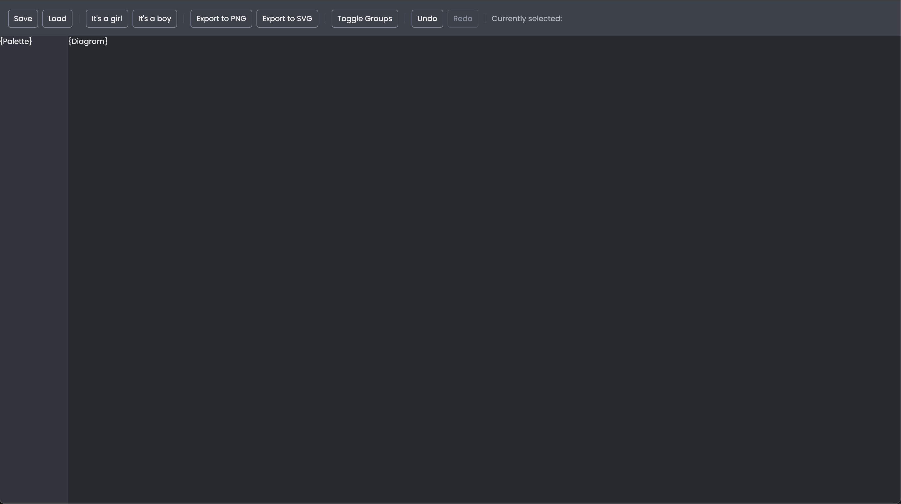

# Project Setup and Introduction

## Intro
Welcome to the first lesson of this GoJS course! In this lesson, we’ll go over the starter project and prepare it for working with GoJS in future lessons. Here’s what you need to know about the current setup and structure:

## Lesson Objectives
* get familiar with the `app` project
* run the project

## Prerequisites
To start coding,
we need to have a few things installed first.
If you don't have the tools listed below installed yet, please install them now.

* [Node.JS and npm](https://docs.npmjs.com/downloading-and-installing-node-js-and-npm)
* Code editor of your choice

# Project Overview

This project is built with Webpack and TypeScript, ensuring efficient module bundling and strong typing support. While we’ve included GoJS as a dependency in `package.json`, it isn’t used just yet. The following lesson will guide you through initializing and setting up your first GoJS diagram.

## Basic Layout and Design

The project has a pre-configured `index.html` file with CSS for a simple, clean design. All buttons and HTML elements you'll need throughout the course are already created and styled, so you can focus on writing code instead of setting up the UI.

## Pre-Built Utilities

Two key classes, `theme.ts` and `page-elements.ts`, are provided to development easier. These are singleton classes, meaning only one instance of each is created, and they’re lazy-loaded to optimize performance. You can access their instances with a simple import, ensuring easy and consistent usage across the app.

1. **theme.ts**:
   - The `Theme` class manages CSS variables, allowing easy access to colors and other style properties defined in CSS.
   - Use the `getValue()` method to retrieve CSS variable values by name, keeping your styling consistent and easy to maintain.
   - Commonly used color variables (like `Gray200`, `Gray500`, etc.) are defined in a `CssVariable` enum, so you can refer to them by name instead of hardcoding values.

2. **page-elements.ts**:
   - The `PageElements` class centralizes all the HTML elements you’ll interact with, like buttons, divs, and tooltips.
   - This class gathers and exposes each essential UI element as properties, such as `diagramDiv`, `paletteDiv`, and `saveButton`.
   - This way, accessing and manipulating these elements in your code is straightforward and avoids repetitive `getElementById` calls.

## Starting Point: `index.ts`

The main entry point of the app is `index.ts`. This file includes `pageElements`, which provides quick access to the core UI elements. An event listener on the `window` `load` event ensures that all elements are available before any interactions take place. This setup will serve as the foundation for future GoJS integration, making it easy to link diagramming interactions with existing HTML elements.

## Supporting Files

- **`data.ts`**: Contains the JSON data model used in the course. The model represents nodes (members of the British royal family) and links (parent-child relationships between them).
- **`hydrate-with-group-data.ts`**: A helper method for enhancing node data with group information. Each family member within a group is assigned a `group` property containing the appropriate `groupId`. Additionally, the data array is extended to include group nodes.
- **`download-file.ts`**: A method that simplifies file downloads by requiring only a `Blob` object and a file name as input.
- **`icons.ts`**: Includes all the icons used in the course, stored in Base64 format for optimal performance and faster loading times, especially in GoJS.

# Testing the Setup

To ensure everything is working, run the following commands:
1. Install dependencies with `npm install`.
2. Start the project with `npm run start`.
3. Open `http://localhost:8080` in your browser. You should see the app running successfully, indicating that your setup is complete.

Now you’re ready to move to the next lesson, where we’ll begin by adding a GoJS diagram!

## Homework
There's no homework to this lesson, but there will be in the next ones!
