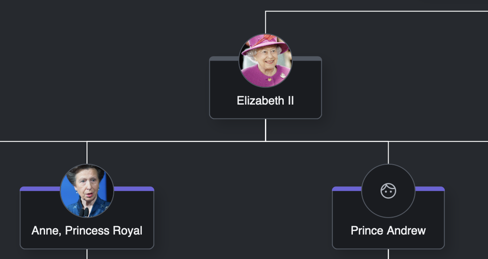

# Node Templates

## Intro
In this lesson, we'll customize the look and feel of the node templates

## What you'll learn
* How to create a custom look of a diagram node
* How to work with GoJS shapes, text blocks, pictures, and ports
* How to bind node data with its template

## GoJS Node Templates Structure

GoJS nodes are composed of many GraphObjects such as Panels, Shapes, TextBlocks, etc. As you saw in the previous lesson, a node definition must start with the `go.Node` declaration.

```javascript
// node-template.ts
//...
export const createNodeTemplate = () =>
  $(
    go.Node,
    { background: "lightgreen" },
    $(go.TextBlock, { margin: 10 }, new go.Binding("text", "name"))
  );
```

Inside a node, we've added an Automatic Panel that holds the TextBlock displaying the family member's name.


## Panels and Shapes

We want our family tree to look more complex rather than just a simple rectangle with a family name in it. Let's enhance our template with a family member photo placeholder and a sleek name container.

First, let's change the Panel type from Auto to Spot. There are a few [panel](https://gojs.net/latest/intro/panels.html) types in GoJS.

The prime difference between Panel Auto and Panel Spot is that Panel Auto resizes the main element to fit around other elements, whereas Panel Spot arranges the graph objects around the main element using alignment properties. In our case, to position elements correctly, we need to use Panel Spot.

Next, let's add a circle shape (`go.Shape`), which will be our placeholder for the family members' photos.


``` javascript
// node-template.ts
//...
export const createNodeTemplate = () =>
  $(
    go.Node,
    go.Panel.Spot,
    $(
      go.TextBlock,
      {
        margin: new go.Margin(30, 10, 10, 10),
        background: "lightgreen",
      },
      new go.Binding("text", "name")
    ),
    $(go.Shape, "Circle", {
      desiredSize: new go.Size(60, 60),
      fill: "green",
      alignment: new go.Spot(0.5, 0, 0, -30),
    })
  );
```


All good so far. However, it would be better to wrap the textbox with a nicer container.

To achieve that, we have to add a new Auto Panel inside our main Panel Spot. It'll contain the Rounded Rectangle Shape (which is going to be a main graph object for the Auto Panel as it's declared first). Underneath, we can place the TextBlock with the family member's name.

As you already know, Auto Panel resizes the main object to fit around other objects. In our case the Rounded Rectangle will fit around the TextBlock, so we don't need to worry about its size.

Moreover, we want the photo placeholder to show above the Rounded Rectangle and overlap it. To achieve this, we need to use the `alignment` and `alignmentFocus` properties.

The `alignmentFocus` property defines the spot on the Graph Object to be used as the alignment point. `alignment` sets the alignment Spot of the Graph Object, so in other words, it positions the element.

We'll set the `alignment` to `go.Spot.Center` and `alignmentFocus` to `go.Spot.MiddleBottom`. This simply means "I want the middle bottom point of my shape to be placed in the center of the container".

``` javascript
// node-template.ts
//...
export const createNodeTemplate = () =>
  $(
    go.Node,
    go.Panel.Spot,
    $(
      go.Panel,
      go.Panel.Auto,
      $(go.Shape, "RoundedRectangle", {
        fill: "lightgreen",
      }),
      $(
        go.TextBlock,
        {
          margin: new go.Margin(30, 10, 10, 10),
        },
        new go.Binding("text", "name")
      )
    ),
    $(go.Shape, "Circle", {
      desiredSize: new go.Size(60, 60),
      fill: "green",
      alignment: go.Spot.Center,
      alignmentFocus: go.Spot.MiddleBottom,
    })
  );
```


## Code organization

Great job so far - we've created the main panel and the placeholder for the photo; however, our code is getting a bit cluttered. Let's reorganize it.

Each block can become a separate function. When we do that, we can clearly see how the parts are nested in each other.

Also, we can slightly improve the colors of our family tree to make it more elegant. We'll also add a shadow to each node using the `isShadowed` property.

``` javascript
// node-template.ts
import { CssVariable, theme } from "../../theme";
//...
export const createNodeTemplate = () =>
  $(
    go.Node,
    go.Panel.Spot,
    {
      isShadowed: true,
      shadowColor: theme.getValue(CssVariable.Shadow),
      shadowBlur: 30,
    },
    familyMemberInfoPanel(),
    photoShape()
  );

const familyMemberInfoPanel = () =>
  $(go.Panel, go.Panel.Auto, containerRectangle(), nameTextBlock());

const photoShape = () =>
  $(go.Shape, "Circle", {
    desiredSize: new go.Size(60, 60),
    fill: theme.getValue(CssVariable.Gray800),
    stroke: theme.getValue(CssVariable.Gray500),
    alignment: go.Spot.TopCenter,
    alignmentFocus: go.Spot.Center,
  });

const containerRectangle = () =>
  $(go.Shape, "RoundedRectangle", {
    fill: theme.getValue(CssVariable.Gray900),
    strokeWidth: 1,
    stroke: theme.getValue(CssVariable.Gray500),
  });

const nameTextBlock = () =>
  $(
    go.TextBlock,
    {
      margin: new go.Margin(40, 10, 10, 10),
      minSize: new go.Size(100, NaN),
      textAlign: "center",
      stroke: theme.getValue(CssVariable.Gray200),
    },
    new go.Binding("text", "name")
  );
```


As you probably noticed, we've introduced `theme` to control styling dynamically within our code. By importing `theme` and the `CssVariable` enum from `theme.ts`, we can easily access and apply CSS variables in our TypeScript code.

## Data Binding

So far, we've mostly been defining static properties of our nodes. As each node represents a different entity, we want to be able to customize each node based on its data.

Let's take a glimpse at our data structure:
``` typescript
export type FamilyMember = {
  key: number;
  parent?: number;
  name: string;
  gender: Gender;
  birthYear: string;
  deathYear?: string;
  reign?: string;
  photo?: string;
};
```

Every entity contains a name property. We've already created a binding to display each
family member's name on our node:

``` javascript
// node-template.ts
//...
new go.Binding("text", "name")
//...
```

This simple line tells GoJS to set the `text` property of the TextBlock to whatever it finds under the `name` property for each entity.

GoJS gives us the flexibility to create [bindings](https://gojs.net/latest/intro/dataBinding.html) to almost every property. Let's create an indicator to show if the family member is dead or alive.

First, let's create an indicator graph object:

``` javascript
// node-template.ts
//...
const aliveIndicator = () =>
  $(go.Shape, "RoundedRectangle", {
    desiredSize: new go.Size(NaN, 5),
    alignmentFocus: go.Spot.Bottom,
    alignment: new go.Spot(0.5, 0, 0, 5),
    fill: theme.getValue(CssVariable.Gray500),
    stretch: go.Stretch.Horizontal,
    parameter1: 4,
    parameter2: 1 | 2,
    strokeWidth: 0,
  });
```

In the code above, we set `parameter1` and `parameter2` to control the shape's corner rounding. `parameter1` adjusts the corner radius, ensuring it matches the panel info container's corner radius. `parameter2` is set to round only the top corners of the indicator. You can find more information about shapes and parameters [here](https://gojs.net/latest/samples/shapes.html).

Additionally, notice the use of `desiredSize: new go.Size(NaN, 5)` and `stretch: go.Stretch.Horizontal`. By setting `stretch` to `go.Stretch.Horizontal`, we ensure the width of the indicator matches the width of the node panel. Since the indicator's height remains constant, `desiredSize` is set to `go.Size(NaN, 5)`, where `NaN` allows the width to be dynamically adjusted based on the container size. 

Now, we can add it to our template:

``` javascript
// nodeTemplate.ts
export const createNodeTemplate = () =>
  $(
    go.Node,
    //...
    familyMemberInfoPanel(),
    aliveIndicator(),
    photoShape()
  );
//...
```

To make the indicator functional, we need to create a binding

```javascript
// node-template.ts
//...
  new go.Binding("fill", "deathYear", (deathYear) =>
    deathYear
      ? theme.getValue(CssVariable.Gray500)
      : theme.getValue(CssVariable.Purple500)
  )
//...
``` 

Compared to our previous text binding, this one has an additional parameter: the converter.
It tells GoJS to apply the color `CssVariable.Gray500` if `deathYear` is defined in the model. Otherwise, `CssVariable.Purple500` is applied.

Unfortunately, when we check the app we'll see that the indicator stays gray for every person, indicating that there's something wrong with the binding. 

It has to do with how GoJS handles `undefined` in bindings.
The `deathYear` property isn't always present in the data objects.
Therefore, in some cases, we're binding to a non-existent value.
GoJS doesn't handle `undefined` in bindings particularly well and the binding won't work.

Let's change the source property to an empty string:

```javascript
// node-template.ts
//...
  new go.Binding("fill", "", (data) =>
      data.deathYear
        ? theme.getValue(CssVariable.Gray500)
        : theme.getValue(CssVariable.Purple500)
    )
//...
``` 
When the source property is set to an empty string, the whole data object is passed to the converter function.

Binding to the whole object data resolves that issue because it is always called when a change in the data object occurs (including setting values to null/undefined).

This type of binding is convenient but has other drawbacks.
Setting the source prop to an empty string means that the binding will be fired on every change to the node, which hurts performance.
It's not that noticeable in our case, but having many of these bindings together with lots of nodes on the diagram will lead to the diagram struggling to update every single one of them.

In cases where there are no other options (such as, when properties are dynamically computed) this binding approach is necessary. However, in our case, there's a more efficient alternative. Rather than binding to the entire data object, we can pass the specific properties needed by creating two targeted bindings:

```javascript
// node-template.ts
//..
const getIndicatorColor = (deathYear?: string) =>
  deathYear
        ? theme.getValue(CssVariable.Gray500)
        : theme.getValue(CssVariable.Purple500)
//...
    new go.Binding("fill", "birthYear", (_, obj) =>
      getIndicatorColor((obj.part.data as FamilyMember).deathYear)
    ),
    new go.Binding("fill", "deathYear", (deathYear) =>
      getIndicatorColor(deathYear)
    )
//...
``` 
By binding to `birthYear`, the converter function is always called. When `deathYear` is available in the data, it will also call the same function, returning the appropriate color. This is useful when calculating values based on multiple, non-computed properties.

However, there's an even simpler approach. Since the binding doesn't trigger when `deathYear` is `undefined`, we can set a default color directly with `fill: theme.getValue(CssVariable.Purple500)` and then apply the binding as follows:

```typescript
// node-template.ts
//...
const aliveIndicator = () =>
  $(
    go.Shape,
    "RoundedRectangle",
    {
      //...
      fill: theme.getValue(CssVariable.Purple500),
      //...
    },
    new go.Binding("fill", "deathYear", () =>
      theme.getValue(CssVariable.Gray500)
   )
  );
```

With this approach, the fill color will only change when `deathYear` is defined.


You can read more about GoJS performance [here](https://gojs.net/latest/intro/performance.html).

## OfObject Binding

GoJS allows us to bind properties not only to the data model but also to other properties of graph objects. Currently, the width of our indicator is automatically calculated because it inherits the size of its parent container. However, there are cases where we need to calculate a property based on a different panel's properties.

For instance, if we wanted the indicator's width to align specifically with the size of the `familyMemberInfoPanel`, we could implement an alternative solution.

First, we need to add an identifier to the family member info panel:

```javascript
// node-template.ts
//...
const familyMemberInfoPanel = () =>
  $(
    go.Panel,
    go.Panel.Auto,
    {
      name: "FAMILY_MEMBER_INFO_PANEL",
    },
    //...
  );
//...
```

Now, we can create a binding in the alive indicator:

```javascript
// node-template.ts
//...
const aliveIndicator = () =>
  $(
    go.Shape,
    "RoundedRectangle",
    //...
    new go.Binding("desiredSize", "name", (_, obj) => {
      obj.part.ensureBounds();
      const { width } = obj.part.actualBounds;
      return new go.Size(width, 5);
    }).ofObject("FAMILY_MEMBER_INFO_PANEL"),
  );
//...
```

Let's break it down into pieces:
```javascript
// node-template.ts
//...
new go.Binding("desiredSize", "name", (_, obj) => {
    //...
}).ofObject("FAMILY_MEMBER_INFO_PANEL"),
//...
```
These lines define a binding where the target property is `desiredSize`, and the source property is `name`. The `name` property is used as the source because whenever it changes, `desiredSize` should be updated accordingly. Although we don't use the `name` value itself, it allows us to trigger the converter function to dynamically calculate the `desiredSize` based on the `obj` (the second parameter). 

This approach ensures that `desiredSize` adjusts automatically when `name` changes.

```javascript
// node-template.ts
//...
obj.part.ensureBounds();
//...
```
As the size of the family member info panel is dynamic and depends on the length of the text, we need to call the `ensureBounds` method for GoJS to calculate the correct size.

```javascript
// node-template.ts
//...
const { width } = obj.actualBounds;
//...
```
Having calculated the actual size of the family member info panel, we can extract the width.

```javascript
// node-template.ts
//...
return new go.Size(width, 5);
//...
```
Finally, we return the desired size: width of the family member info panel and a static `5px` height.

## Pictures

GoJS lets you add pictures to the diagram using the `go.Picture` block.

To add a picture block, we have to wrap the previously created `photoShape` with a Panel. 
In order to do so, we need to create a Spot Panel and move the previously defined alignment properties there.
In the panel, there will be two elements: the shape and the picture.

Because we want the photo to be cropped to a circle, we need to create an additional Spot Panel with the property `isClipping` set to `true`.

The code looks as follows:

```javascript
// node-template.ts
//...
export const createNodeTemplate = () =>
  $(
    go.Node,
    //...
    familyMemberInfoPanel(),
    aliveIndicator(),
    photoPanel()
  );
//...
const photoPanel = (size = 60) =>
  $(
    go.Panel,
    go.Panel.Spot,
    {
      alignment: go.Spot.Center,
      alignmentFocus: go.Spot.MiddleBottom,
    },
    photoShape(size),
    photo(size)
  );

const photoShape = (size: number) =>
  $(go.Shape, "Circle", {
    desiredSize: new go.Size(60, 60),
    fill: theme.getValue(CssVariable.Gray800),
    stroke: theme.getValue(CssVariable.Gray500),
  });

const photo = (size: number) =>
  $(
    go.Panel,
    go.Panel.Spot,
    {
      isClipping: true,
    },
    $(go.Shape, "Circle", {
      desiredSize: new go.Size(size - 1, size - 1),
    }),
    $(
      go.Picture,
      {
        imageStretch: go.ImageStretch.UniformToFill,
        desiredSize: new go.Size(size - 1, size - 1),
      },
      new go.Binding("source", "photo")
    )
  );
//...
```


But what about the family members that don't have any photos provided?
We can use what we've learned so far about bindings and extend the photo source binding to show placeholder avatars depending on gender.

```javascript
// node-template.ts
//...
import { WOMAN_AVATAR, MAN_AVATAR } from '../../consts/icons';
import { FamilyMember, Gender } from "../../types/data-types";
//...
const getPhoto = (gender: Gender, photo?: string) =>
  photo ? photo : gender === "F" ? WOMAN_AVATAR : MAN_AVATAR;
//...
const photo = (size: number) =>
  $(
    //...
    $(
      go.Picture,
      {
        //...
      },
      new go.Binding("source", "photo", (photo, obj) =>
        getPhoto((obj.part.data as FamilyMember).gender, photo)
      ), 
      new go.Binding("source", "gender", (gender, obj) =>
        getPhoto(gender, (obj.part.data as FamilyMember).photo)
      )
    )
  );
```

Let's review what we've done here. To meet the requirements for determining what to display, we need to check two properties: `photo` and `gender`. As you may recall from previous examples, we should avoid binding to an empty string when we need access to the entire data object within the converter function.

To accomplish this, we can create two bindings that both call the same `getPhoto` converter function with the appropriate parameters.
```javascript
// node-template.ts
//...
new go.Binding("source", "photo", (photo, obj) =>
  getPhoto((obj.part.data as FamilyMember).gender, photo)
), 
new go.Binding("source", "gender", (gender, obj) =>
  getPhoto(gender, (obj.part.data as FamilyMember).photo)
)
//...
```



## Linking and Ports

To handle the situation when a new child is born, we should add the possibility to add a new family member to the diagram. In the `index.ts`, add:

``` javascript
// index.ts
//..
window.addEventListener("load", () => {
//..
  addGirlButton.onclick = () =>
    diagram.model.addNodeData({ name: "new girl", gender: "F" });
  addBoyButton.onclick = () =>
    diagram.model.addNodeData({ name: "new boy", gender: "M" });
});
```

Now, when you click the buttons, new nodes will be added to the diagram.


Now that we've added new members to our royal family, we should make it possible to connect them to their parents.

In order to do so, we should create [ports](https://gojs.net/latest/intro/ports.html).

In our family tree, we need two types of ports - the child port and the parent port.
The user should be able to draw a line from parent to child.
Moreover, we shouldn't allow a child to be linked with more than one parent.

Let's use the `photoPanel` as the child port and `familyMemberInfoPanel` as the parent port.

``` javascript
// node-template.ts
//...
const photoPanel = (size = 60) =>
  $(
    go.Panel,
    go.Panel.Spot,
    {
      //...
      portId: "child",
      toLinkable: true,
      toSpot: go.Spot.Top,
      toMaxLinks: 1,
    },
    //...
  );
//...
const familyMemberInfoPanel = () =>
  $(
    go.Panel,
    go.Panel.Auto,
    {
      //...
      portId: "parent",
      fromLinkable: true,
      fromSpot: go.Spot.Bottom,
    },
    //...
  );
 //...
```

As you can see, we've told GoJS to allow users to link to the `photoPanel`. Also, we explicitly stated that all links should enter the `photoPanel` from the top. On the contrary, the `familyMemberInfoPanel` is used to create the `from` links and we want all the links to leave it from the bottom.

Last, we need to tell GoJS what the `from` and `to` ports are called in our node definition. To do so, we need to add two additional properties in our `addModel.ts` file:

``` javascript
// add-model.ts
export const addModel = (diagram: go.Diagram) => {
  //...
  model.linkFromPortIdProperty = "fromPort";
  model.linkToPortIdProperty = "toPort";
  //...
};
```

Now we can freely add new family members and link them to their parents.


As we've defined the constraints to our ports, we need to make sure that our data is correctly linked.
To accomplish this, extend the link data array:

``` javascript
// data.ts
//...
export const links: Relationship[] = nodes
  .filter((member) => member.parent !== undefined)
  .map(({ key, parent }) => ({
    from: parent,
    to: key,
    fromPort: "parent",
    toPort: "child",
  }));
```

## Inline Editing

As we add new members, we want to be able to input their names. In GoJS it's very simple. All we need to do is to add the `editable` property to our TextBlock.

``` javascript
// node-template.ts
//...
const nameTextBlock = () =>
  $(
    go.TextBlock,
    {
      //...
      editable: true,
    },
    new go.Binding("text", "name").makeTwoWay()
  );
//...
```

Now, when we double-click on the text, an edit box should appear allowing us to enter a name.
Please note, that we've also added `.makeTwoWay()` to the binding. Thanks to that, when we save our model, the user input will also be preserved as `makeTwoWay` creates a two-way binding.
In other words, every change to the data object will set a corresponding bound property and vice versa.


## Summary

In this lesson we've learned how to create customized node templates, bind data and control the linking between elements. In the next lesson, we'll find out how to customize the appearance and behavior of links.

## Homework

For homework, display the birth year and death year below the family member's name, separated by a horizontal line. Additionally, display a crown icon above the photo if the reign year is specified in the model. You can find the icon with `import { CROWN_ICON } from "../../consts/icons";`.

Below is an example of how the result should look:


