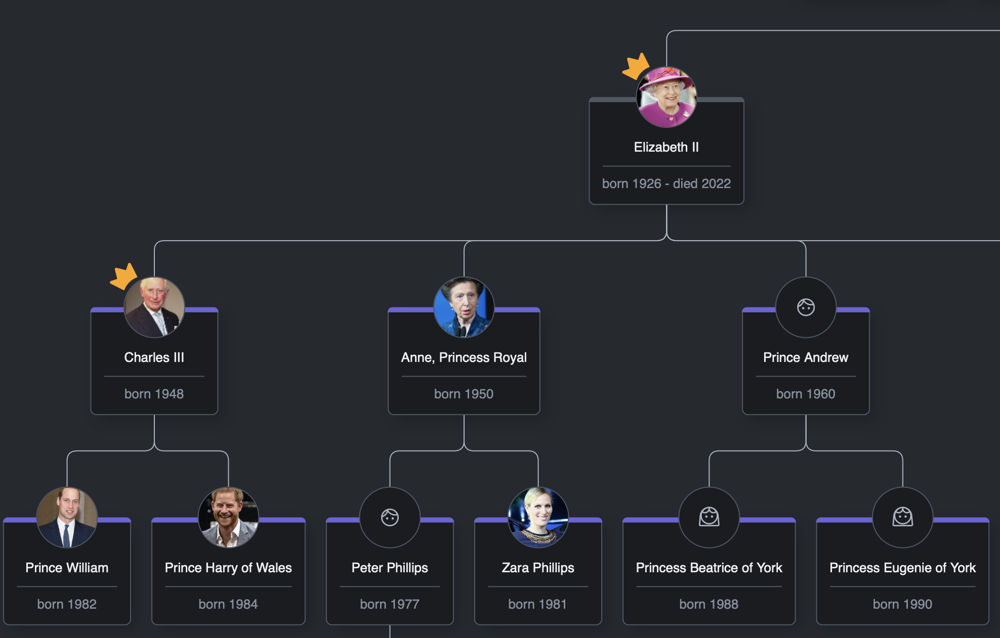
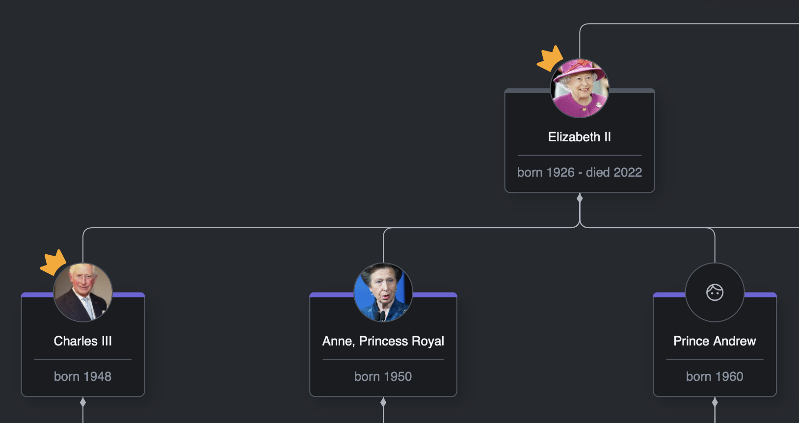
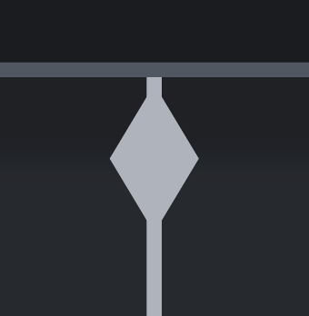
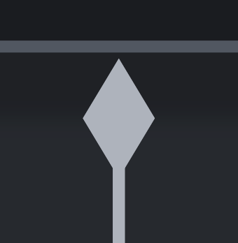
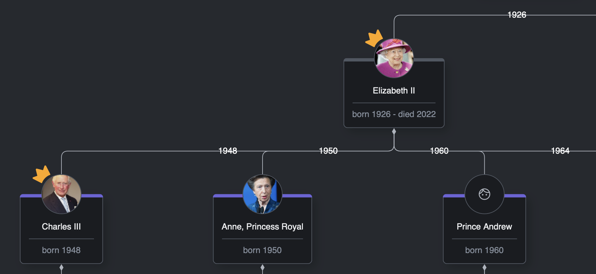
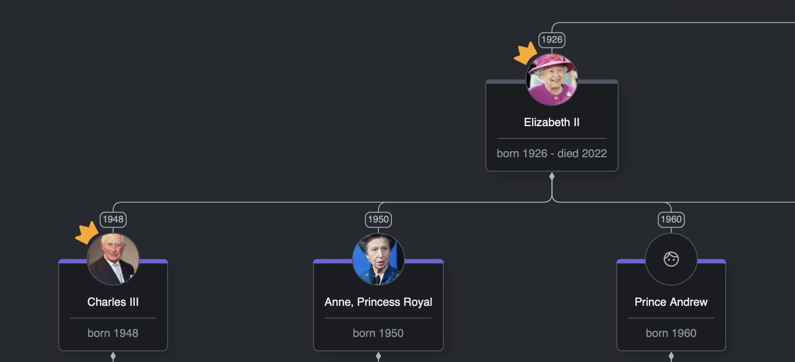

# Link Templates

## Intro
In the previous lesson, we learned how to customize the appearance of a diagram node. During this lesson, we'll customize links.

## What you'll learn
* How to create a custom look of a diagram link
* How to add and style arrowheads
* How to add, style, and bind link labels

## GoJS Link Templates Structure

Similar to node templates, link templates must be defined starting with the `go.Link` declaration. We've already defined a basic template during the first lesson.

``` javascript
//link-template.ts
//...
export const createLinkTemplate = () =>
  $(
    go.Link,
    { routing: go.Routing.Orthogonal },
    $(go.Shape, { stroke: "white" })
  );
```

As before, the `go.Link` line tells us that we're dealing with a link template. The object beneath holds the properties of the link. The `$(go.Shape)` is responsible for the actual shape of the link.

In the properties section, we can specify the routing type of our links. In our scenario, the best routing is Orthogonal. However, GoJS offers a bunch of useful [routing algorithms](https://gojs.net/latest/intro/links.html#Routing) that you can use in your project.


Having that knowledge, let's split the link template into parts, change the color, and apply some smoothness.

``` javascript
//link-template.ts
//...
import { CssVariable, theme } from "../../theme";
//...
export const createLinkTemplate = () =>
  $(go.Link, { routing: go.Routing.Orthogonal, corner: 10 }, linkShape());

const linkShape = () =>
  $(go.Shape, {
    stroke: theme.getValue(CssVariable.Gray300),
  });
```




## Arrowheads

GoJS allows us to define arrowheads for our links. All we have to do is add another shape to our list and declare the `toArrow` or `fromArrow` property.

``` javascript
//link-template.ts
//...
export const createLinkTemplate = () =>
  $(
    go.Link,
    {
    //...
    },
    linkShape(),
    arrowHead()
  );
//...
const arrowHead = () =>
  $(go.Shape, {
    fromArrow: "StretchedDiamond",
    stroke: null,
    fill: theme.getValue(CssVariable.Gray300),
  });
```



In order to get rid of the link fragment that overflows beyond our arrowhead, we can shorten the link using the `fromShortLength` property.
``` javascript
export const createLinkTemplate = () =>
    $(
        go.Link,
        {
            ...
            fromShortLength: 2,
        },
        ...
    );
```
Before:  


After:  


## Link labels and bindings

Just like node templates, link templates support bindings. Let's bind the birth years of the family members to the links.

``` javascript
//link-template.ts
//...
import { FamilyMember } from "../../types/data-types";
//...
export const createLinkTemplate = () =>
  $(
    go.Link,
    //...
    birthYear()
  );
//...
const birthYear = () =>
  $(
    go.TextBlock,
    {
      stroke: "white",
    },
    new go.Binding(
      "text",
      "toNode",
      (toNode) => (toNode.data as FamilyMember).birthYear || ""
    ).ofObject()
  );
```

Note that we've used the `ofObject` binding to retrieve the entire link object.
From there we can retrieve information about the node to which the link points and obtain the nodes data.

Another important consideration is that if `birthYear` changes, the binding won't trigger automatically. This happens because it doesn't depend on the link data, and the reference to `toNode` remains unchanged.
To fix that, we would need to update the bindings on connected links manually.

``` javascript
link.updateTargetBindings("toNode");
```

We'll skip that for now, as the birth year won't change, but it's something we should be aware of.



Finally, let's use our knowledge from the previous lesson and add some styling to the birth year block.

``` javascript
//link-template.ts
//...
const birthYear = () =>
  $(
    go.Panel,
    go.Panel.Auto,
    {
      segmentIndex: NaN,
      segmentFraction: 1,
      segmentOffset: new go.Point(-15, 0),
    },
    $(go.Shape, "RoundedRectangle", {
      fill: theme.getValue(CssVariable.Gray800),
      stroke: theme.getValue(CssVariable.Gray300),
    }),
    $(
      go.TextBlock,
      { stroke: theme.getValue(CssVariable.Gray300), font: "11px sans-serif" },
      new go.Binding(
        "text",
        "toNode",
        (toNode) => (toNode.data as FamilyMember).birthYear || ""
      ).ofObject()
    ),
    new go.Binding(
      "visible",
      "toNode",
      (toNode) => !!(toNode.data as FamilyMember).birthYear
    ).ofObject()
  );
```

We've wrapped our label in a panel, and we've declared a rounded rectangle shape with desired parameters. Next, we've created a text block to fit inside the shape. Finally, we've added a visibility binding that should show the year indicator if the year is defined.

To position the label on the link, we've used the `segmentIndex`, `segmentFraction` and `segmentOffset` properties. If you want to dive deeper into link labels, please refer to [GoJS docs on link labels](https://gojs.net/latest/intro/linkLabels.html).



## Summary

In this lesson, we've learned how to modify the appearance of links and how to bind data to link labels.

## Homework

For homework, change the link line from solid to dashed. Play around with different dash styles.

