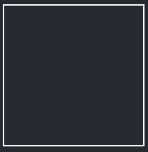
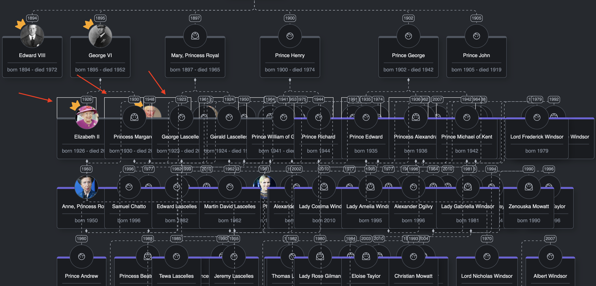
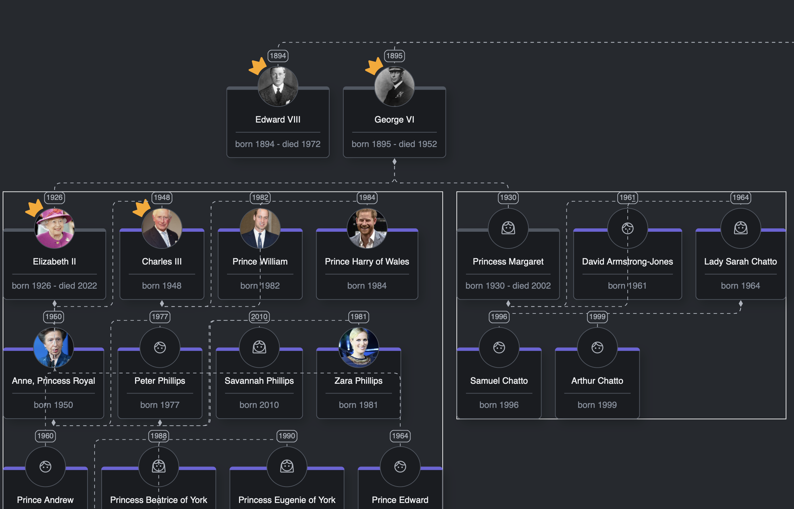
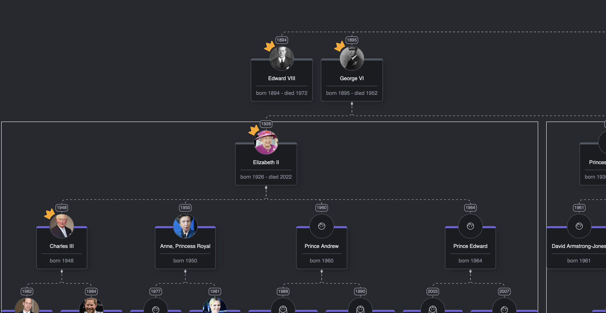
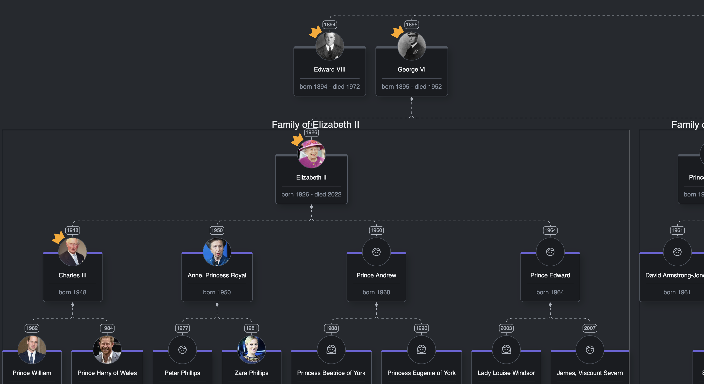

# Group Templates

## Intro
In some cases, we'd like to move a group of nodes at the same time.
To do that we'd have to select each of them separately.
What about iterating through some nodes that we treat as a group?
We would need to go through all the nodes and filter the ones that interest us.
All these problems can be solved thanks to groups which are the subject of this lesson.

## What you'll learn
* How to create groups for nodes
* How to create a custom look for a group
* How to add nodes to groups
* What kind of possibilities groups give us

## Creating a group template

A group is nothing more than just another kind of template, but this time we'll define it with `go.Group`.

Inside the `templates` directory create a file `groupTemplate.ts` in which we'll create our group template.

``` typescript
// group-template.ts
import * as go from "gojs";

const $ = go.GraphObject.make;

export const createGroupTemplate = () =>
  $(
    go.Group,
    go.Group.Spot,
    $(
      go.Panel,
      go.Panel.Auto,
      $(go.Shape, {
        stroke: "white",
        fill: "transparent",
      })
    )
  );
```

As in the previous lessons, the first line tells us what we're dealing with. In this case, we'll start with `go.Group`.
We'll make it a `go.Group.Spot` to easily place some labels later.
Inside the group, we'll add an automatic panel and set its `fill` to transparent and `stroke` to white.
We set it to transparent so the group registers mouse events on its background.
If we had left it with null/undefined, the group would only be selectable on the border. Think of it as having a frame with nothing (null) or a sheet of glass (transparent) inside.

Like with node and link templates, we need to register it.
Go to `register-templates.ts` and add this code:

```typescript
// register-templates.ts
//...
import { createGroupTemplate } from "../templates/group-template";

export const registerTemplates = (diagram: go.Diagram) => {
  //...
  diagram.groupTemplateMap = new go.Map([
    { key: "", value: createGroupTemplate() },
  ]);
};
```

As you can see declaring a group template, we should see how it looks.
We just need to assign a new map to `groupTemplateMap` in which we pass our template.

Now that we've registered our group template it'd be good to see how it looks.
For that, we need to create a new element inside our data.
Since we have `links` for links and `nodes` for nodes, you'd probably expect that there will be another array for groups.
Groups are added by declaring them inside `nodeDataArray`.
So how does GoJS know which template to use?
We just need to pass the `isGroup: true` property to such an element.

Let's try to display such a group.
Inside `data.ts` create a new array in which we'll declare all groups and add one:

```typescript
// data.ts
//...
const groups = [{ key: -1, isGroup: true }];
```

In the next step, it would be good to export nodes and groups together as one array. To do that you can use spread operators:

```typescript
// data.ts
//...
export const nodesWithGroups = [...nodes, ...groups];
```

The last thing we need to do to see some results is to replace `nodes` with `nodesWithGroups` inside `add-model.ts`:

```typescript
// add-model.ts
import { links, nodesWithGroups } from "../../data/data";
//...
model.nodeDataArray = nodesWithGroups;
//...
```

Now when we refresh our app at the bottom-left corner of the diagram we should see a square with a black border - this is our group.



For now, it doesn't look different from a simple node so in the next step we'll try to place nodes inside our group.

## Assigning nodes to a group

Imagine a situation in which we'd like to have parts of a family separated on some level and treat them as a group.
In this example, we'll create a group for every family of George V's grandchildren.

To assign a node to a group we need to add the `group` property to such a node.
GoJS will take care of adding this node to the group.

Go to the `data.ts` file and assign Elizabeth II to our created group:

```typescript
//data.ts
//...
export const nodes: FamilyMember[] = [
  //...
  {
    key: 7,
    parent: 2,
    group: -1,
    name: "Elizabeth II",
    gender: "F",
    birthYear: "1926",
    deathYear: "2022",
    reign: "1952-2022",
    photo:
      "https://upload.wikimedia.org/wikipedia/commons/5/50/Queen_Elizabeth_II_March_2015.jpg",
  },
  //...
]
```

We've added a `group` property to the node, and we've set the value to `-1` which equals the `key` property of the desired group.

Now we should add this property to all children and grandchildren of Elizabeth and create new groups, then repeat it for all her cousins.
This would take too much time, so we've already created a function that will map all the nodes for us.

All we need to do is:

```typescript
//data.ts
import { hydrateDataWithGroups } from "./hydrate-with-group-data";
//...
export const nodesWithGroups = hydrateDataWithGroups(nodes);
```

Now to `nodesWithGroups` we pass mapped `nodes` together with `groups` so that every person which should be in some group will be assigned to it.

Awesome. Let's see the result!



Well... that looks really messy.
As you can see, red arrows indicate our groups, which are definitely too small to contain all the nodes.
In the next step, we'll fix that so that the diagram will look like it did before, but with split families in groups.

## Adjusting group template

The first question we have now is: how to change group size so that it will always contain all the nodes?
The answer to that is an object called `Placeholder`.
It stores the union of the bounds of the member parts.
It has only one settable property: padding.
Because it always represents the union of parts inside, should we want, for example, to expand the group ourselves by dragging on a handle, yet still have the ability to auto-expand the group when manually dragging a node, we'd need to resort to different measures.
That's why it is sometimes better to resign from `Placeholder` and try to code its functionalities ourselves.
Nevertheless, let's add it to our `group-template.ts` and see how it behaves:

```typescript
//group-template.ts
//...
export const createGroupTemplate = () =>
  $(
    go.Group,
    go.Group.Spot,
    $(
      go.Panel,
      go.Panel.Auto,
      //...
      $(go.Placeholder)
    )
  );
```


Now it looks better because the group surrounds all the nodes, but still it doesn't look quite right.
Another issue is that the diagram layout property works only for top-level nodes and links.
Nodes and links inside groups are now being treated as [subgraph](https://gojs.net/latest/intro/subgraphs.html), which means they're not being laid out by the diagram's layout.
To fix that, we need to apply the same layout for groups as for the diagram:

```typescript
//group-template.ts
//...
const groupLayout = new go.TreeLayout();
groupLayout.angle = 90;

export const createGroupTemplate = () =>
  $(
    go.Group,
    go.Group.Spot,
    {
      layout: groupLayout,
    },
    //...
  );
```



Now it looks much better!
The last thing we can do is to add a label to the group that will describe its content. We need to add a `TextBlock` to our `groupTemplate.ts` to display the label.

```typescript
//group-template.ts
//...
export const createGroupTemplate = () =>
  $(
    go.Group,
    go.Group.Spot,
    //...
    $(
      go.TextBlock,
      {
        alignment: new go.Spot(0.5, 0, 0, -10),
        font: "20px sans-serif",
        stroke: theme.getValue(CssVariable.Gray200),
      },
      new go.Binding("text", "name")
    )
  );
```

It'll position a label in the top center and move it up by 10px.
We've added a binding that will display the text depending on the name property.



As you can see, the label is displayed above the group, which looks quite nice.

## Summary

In this lesson, we've learned how to register a group template and created the first template of a group.
More importantly, we know how to assign nodes to the group, which gives us a lot of benefits.
For example, now you can move all of Elizabeth II's family members together by dragging the group.
Also, If you want to create functionalities that need to be applied to all nodes of a group, you could simply use the group property called `memberParts`.
You can find more about groups [here](https://gojs.net/latest/api/symbols/Group.html)

## Homework

- Add padding to the group (e.g., 25) to create more spacing around its contents.
- Modify the group shape to make it more rounded.
- Update the group's border color to match the border color of the nodes for a consistent design.
