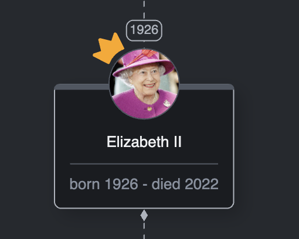
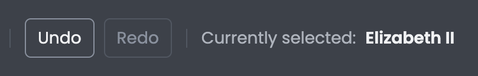

# Diagram events

## Intro
In this lesson, we'll have a look at events occurring in GoJS.

## Lesson Objectives
* How to handle object events.
* How to add event listeners.

## Object events
Most GoJS classes come with some useful properties that can be set.
Some classes, like the `go.Diagram` or the `go.GraphObject` for instance, have properties to which we can assign functions. Those are then automatically invoked by GoJS, when a specific event occurs on the diagram or the object.
For example, if we'd like to perform some changes on a node when the user clicks or hovers over it, we can simply assign a handler function to the corresponding property on the node and it will be invoked when a particular event happens.

Let's say we want to highlight a node when the user hovers their mouse over it.
We'll have to set two properties: `mouseEnter` and `mouseLeave`.
These properties are inherited from the `go.GraphObject` class.
The first one will be responsible for highlighting the node when the cursor enters its area, and the second one will remove the highlight when the cursor leaves the area occupied by the node.

First, in `node-template.ts` we define mouse events handlers as below

```typescript
//node-template.ts
//...
export const createNodeTemplate = () =>
  $(
    go.Node,
    {
      //...
      mouseEnter: (_, node: go.Node) => (node.isHighlighted = true),
      mouseLeave: (_, node: go.Node) => (node.isHighlighted = false)
    },
    //...
  );
```
We use the `isHighlighted` property available on the node's `Part` object, which can be updated freely. By correctly managing the `isHighlighted` state, we can create a binding that reacts to this property and highlight the node.

```typescript
//node-template.ts
//...
const containerRectangle = () =>
  $(
    go.Shape,
    "RoundedRectangle",
    //...
    new go.Binding("stroke", "isHighlighted", (isHighlighted) =>
      isHighlighted
        ? theme.getValue(CssVariable.Gray300)
        : theme.getValue(CssVariable.Gray500)
    ).ofObject()
  );
```

Now let's move to the browser window and verify, that what we've just implemented works properly.
In the browser, hover the mouse over any of the nodes and you'll notice that its border has changed the color. It should look like this:



Why didn't we set the handler on the shape object itself? There are two reasons for that.
First, we want to highlight the node when the cursor hovers over any part of the node, not just the shape itself.
The second reason is that the events are fired on the top-most objects.
In our case, if we hovered the cursor over the name of a person, the highlight would disappear despite the mouse being technically over the background.
Try it for yourself to better understand the issue.

Because `mouseEnter` and `mouseLeave` are coming from the `go.GraphObject` class, nearly all objects we're creating can have these properties set.
To sum up object events, let's handle an event that is specific only for one type of object, in this case, `go.TextBlock`.
Right now we can edit the names of the people, but nothing is stopping us from passing in an empty string.
To prevent that, we'll use the `textEdited` property which can only be found in `go.TextBlock`.
If the user enters an empty string, we'll set the text back to what it was before and alert the user to what happened.

Add the code below:

```typescript
//node-template.ts
//...
const textEdited = (
  textBlock: go.TextBlock,
  oldText: string,
  newText: string
) => {
  if (newText === "") {
    textBlock.text = oldText;
    alert("The name field cannot be empty");
  }
};
//...
export const createNodeTemplate = () => {
    //...
}
//...
```

Then, in the definition of object `nameTextBlock`, set the property `textEdited` to our newly created function:

```typescript
//node-template.ts
//...
const nameTextBlock = () =>
  $(
    go.TextBlock,
    {
      //...
      textEdited
    },
    //...
  );
//...
```

Let's go back to the browser and test the new feature. Try to edit the name of a person and set it to an empty string.
If you can't, that's what we were after.  

Note: we could also use `textValidation`.
In our case, because we want to prevent entering an empty string, it would not let us remove it first as it's validating the input on each keypress.
Deleting the content would make it an empty string and the validator would set it back to the previous one, making it impossible to "start clean". 

In the next section, we'll have a look at the diagram events and how we can use them in certain scenarios.

## Diagram events

In the previous section, we've learned how to handle events for objects.
What if we want to perform actions based on events that are not bound to any specific object, but can occur anywhere on the diagram?
That's where `go.DiagramEvent` and event listeners come in handy.
The `go.Diagram` class provides three ways to add listeners:

* [addChangedListener](https://gojs.net/latest/api/symbols/Diagram.html#addChangedListener)
* [addDiagramListener](https://gojs.net/latest/api/symbols/Diagram.html#addDiagramListener)
* [addModelChangedListener](https://gojs.net/latest/api/symbols/Diagram.html#addModelChangedListener)

We'll focus on `addDiagramListener`, as the remaining two work in a similar manner but are rarely used.

The functions signature looks as follows:

```typescript
addDiagramListener(name: DiagramEventName, listener: (e: DiagramEvent) => void): void
```

The `name` parameter is the name of a DiagramEvent to which we want to listen. And the `listener` parameter is the function that is called after the given DiagramEvent has occurred.
The list of all DiagramEvents can be found [here](https://gojs.net/latest/api/symbols/DiagramEvent.html).

To try out listeners, we'll use `selectedPerson` div on a header to display currently selected person.

In the diagram folder create `register-listeners.ts` file

```typescript
//register-listeners.ts
import * as go from "gojs";
import { pageElements } from "../../dom/page-elements";

const handleSelectionChange = (e: go.DiagramEvent) => {
  const { diagram } = e;
  const { selectedPerson } = pageElements;

  if (diagram.selection.count !== 1) {
    selectedPerson.innerText = "";
    return;
  }
  const selection = diagram.selection.first();
  if (!(selection instanceof go.Node) || selection instanceof go.Group) {
    selectedPerson.innerText = "";
  } else {
    selectedPerson.innerText = selection.data.name;
  }
};

export const registerListeners = (diagram: go.Diagram) => {
  diagram.addDiagramListener("ChangedSelection", handleSelectionChange);

  return () => {
    diagram.removeDiagramListener("ChangedSelection", handleSelectionChange);
  }
};
```

Next, in `diagram.ts` call the function

```typescript
//diagram.ts
//...
import { registerListeners } from "./register-listeners";
//...
export const createDiagram = (diagramDiv: HTMLDivElement) => {
  //...
  registerListeners(diagram);

  return diagram;
};
```

Now, every time when we select a person, their name will be displayed in our header:



Let's go through the code because we also had to make some checks along the way.

If the user has selected more than one or zero objects, we don't want to display anything:

```typescript
if (diagram.selection.count !== 1) {
    selectedPerson.innerText = "";
    return;
}
```

Next, we get the selected element:

```typescript
const selection = diagram.selection.first();
```

We also need to check if the user selected a node, and not, for example, a link.
At the end we check if the node is not a group since `go.Group` inherits from `go.Node`.
When everything is okay, we display the person's name:

```typescript
if (!(selection instanceof go.Node) || selection instanceof go.Group) {
    selectedPerson.innerText = "";
} else {
    selectedPerson.innerText = selection.data.name;
}
```

As you can see, the diagram events require quite a lot of checks to make sure we're dealing with the things we're interested in.
Therefore, try to stick to object events if possible.

You can also assign categories to objects even when there's only one of each type as we have in our app.
Then it boils down to checking the category to determine exactly what we're dealing with.

As you may also have noticed, the `registerListeners` method returns a function that removes the listener. It's a good practice to remove listeners that are no longer needed, especially when, for example, the entire diagram is removed from the page.

## Summary

In this lesson, we've learned a few things about various events we can use in GoJS.
From now on, you should know how to register and handle events that might occur both on the diagram or some objects.

## Homework

For homework, disable the save button and only enable saving when actual changes were made to the diagram.
Make sure to also disable it after the diagram has been saved.
> HINT: Look for `Modified` DiagramEvent.
