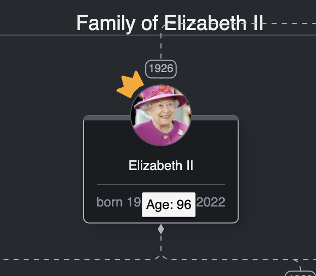
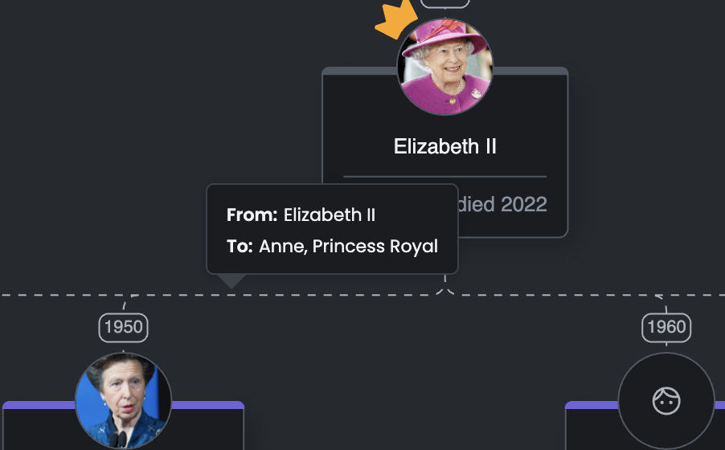

# Tooltips

## Intro
In this lesson, we'll focus on a very popular way of providing additional information for some objects in a diagram - tooltips.

## Lesson Objectives
* How to create and use native GoJS tooltips
* How to create and use custom HTML tooltips

## Native tooltips in GoJS
Since it's a common requirement to have tooltips displayed in your diagram,
GoJS provides us with native support for them.
To display a tooltip when the user hovers over some objects or even the diagram itself,
we need to assign a `go.Adornment` template to the `tooltip` property available on the `go.GraphObject` or `go.Diagram` class.

We'll have to get a little bit creative when it comes to the additional information shown in our tooltip, since we don't have much data in the `data.ts` that has not already been presented in one form or another. 
To not modify the data, when hovering over a particular family member, we'll calculate and display the age of that person.

To show a native GoJS tooltip when the user hovers over a node, we'll have to create a template of it first.

Inside the `templates` directory, add a new file named `native-tooltip-template.ts` with the following content:
```typescript
//native-tooltip-template.ts
import * as go from "gojs";
import { FamilyMember } from "../../types/data-types";

const $ = go.GraphObject.make;

const getFormattedAgeMessage = (birthYear: string, deathYear?: string) => {
  const yearToSubtractFrom = deathYear
    ? Number(deathYear)
    : new Date().getFullYear();

  return `Age: ${yearToSubtractFrom - Number(birthYear)}`;
};

export const createNativeTooltipTemplate = () =>
  $(
    "ToolTip",
    $(
      go.TextBlock,
      new go.Binding("text", "birthYear", (x, obj) =>
        getFormattedAgeMessage(x, (obj.part.data as FamilyMember).deathYear)
      ),
      new go.Binding("text", "deathYear", (x, obj) =>
        getFormattedAgeMessage((obj.part.data as FamilyMember).birthYear, x)
      )
    )
  );

```

In the code above, we return a simple tooltip template that displays the age of the person that we're currently hovering over. When creating the message with the person's age, we have to take into consideration two scenarios:
* the person is still alive
* the person has passed away

Based on these, we either take the year of death or the current year as the minuend.

Now, we'll have to attach the tooltip template to the node. Go to the `node-template.ts` file,
import the `createNativeTooltipTemplate` function and attach the new template to the `tooltip` property on our node:
```typescript
// node-template.ts
//...
import { createNativeTooltipTemplate } from "./native-tooltip-template";
//...
export const createNodeTemplate = () =>
  $(
    go.Node,
    go.Panel.Spot,
    {
      //...
      toolTip: createNativeTooltipTemplate()
    },
    //...
  );
//...
```

The default delay for the tooltip to appear is 850 milliseconds, so please be patient. Let's take a look at the result:



Great! We can see that our tooltip is working, and the age of Queen Elizabeth II was given as 96.
As we mentioned, once we hovered over the node of Queen Elizabeth II, we had to wait a while before the tooltip showed up. We'd like it to appear a little bit quicker. That's something we'll take care of next.

To make our new tooltip appear on hover faster, we have to modify the `hoverDelay` property available in the `go.ToolManager`. We'll set the `hoverDelay` property in the `diagram.ts` file. Within this file, add the following line:

```typescript
//diagram.ts
//...
export const createDiagram = (diagramDiv: HTMLDivElement) => {
  //...
  diagram.toolManager.hoverDelay = 100;

  return diagram;
};
```
We set its value to 100 milliseconds so that the tooltip appears almost immediately after we hover over a node.
That's it. Now let's go back to the browser and verify that the tooltip appears faster than before.

GoJS takes care of positioning the tooltip for us, but it's possible to position a tooltip relative to the object(s) it's being displayed for. More information about the positioning of tooltips is available [here](https://gojs.net/latest/intro/toolTips.html#Positioning).

Now let's move to the next section, in which we'll cover a slightly advanced solution for tooltips.

## Custom HTML tooltips
In this section, we'll have a look at custom HTML tooltips that we can use in place of native ones. GoJS allows us to assign a `go.HTMLInfo` object to the `tooltip` property.
To make everything work smoothly using this technique, we'll have to implement the `show` and `hide` methods
available in the `go.HTMLInfo` class. As their names suggest, they'll be responsible for showing and hiding our custom tooltip.

Inside this custom tooltip, we're going to display the names of people that are connected by it.
This is to help the user identify the people at the ends of each link easier.

To add the custom tooltip code, create a new file called `custom-html-tooltip-template.ts` inside the `templates` directory with the following content:
```typescript
//custom-html-tooltip-template.ts
import * as go from "gojs";
import { pageElements } from "../../dom/page-elements";
import { FamilyMember, Relationship } from "../../types/data-types";

const $ = go.GraphObject.make;

const show = (link: go.Link, diagram: go.Diagram) => {
  const { model } = diagram;
  const { tooltip, tooltipFrom, tooltipTo } = pageElements;
  const { from, to } = link.data as Relationship;
  const { viewPoint } = diagram.lastInput;

  const offset = 15;

  tooltip.style.left = `${viewPoint.x - offset}px`;
  tooltip.style.bottom = `calc(100% - ${viewPoint.y - offset}px`;
  tooltip.style.display = "block";

  tooltipFrom.innerHTML = (model.findNodeDataForKey(from) as FamilyMember).name;
  tooltipTo.innerHTML = (model.findNodeDataForKey(to) as FamilyMember).name;
};

const hide = () => {
  const { tooltip } = pageElements;
  tooltip.style.display = "none";
};

export const createCustomHtmlTooltip = () =>
  $(go.HTMLInfo, {
    show,
    hide,
  });
```
There are a couple of things to point out in the code above. To show our custom HTML tooltip,
we've created the `show` function, inside which we have access to the hovered object and the GoJS diagram via functions parameters.
We use those to calculate the position of the tooltip, as we're retrieving the names of people connected by the hovered link so that we can display them inside the tooltip. To show the tooltip, we set its `display` style to `block` (the initial value is `none`).
To hide our tooltip, we simply set the `display` property back to `none` in the `hide` function.
At the end, we create a `go.HTMLInfo` object and pass the new functions to it.  

Note: there are two ways of getting the mouse position: `viewPoint` and `documentPoint`.
`viewPoint` contains coordinates based on what part of the diagram is visible to us at the moment.
When we move the viewport and place the cursor in the same position within the page as before, we get the same coordinates.
On the other hand, `documentPoint` contains coordinates based on the diagram's origin point; therefore, the same cursor position will result in different coordinates based on what part of the diagram we're focused on. It is possible to transform one coordinate system into another:

- [transformDocToView](https://gojs.net/latest/api/symbols/Diagram.html#transformDocToView)
- [transformViewToDoc](https://gojs.net/latest/api/symbols/Diagram.html#transformViewToDoc)

Finally, we have to import and assign the new tooltip to the `tooltip` property on our link template inside the `link-template.ts` file:
```typescript
// link-template.ts
//...
import { createCustomHtmlTooltip } from "./custom-html-tooltip-template";
//...
export const createLinkTemplate = () =>
  $(
    go.Link,
    {
      //...
      toolTip: createCustomHtmlTooltip(),
    },
    //...
  );
// ...
```

Alright, this should be good to go. Let's go to the browser and check the result by hovering over a link:


Fantastic! The custom HTML tooltip appears in the proper position and displays the information we wanted to show.
With custom HTML tooltips, we can utilize the full potential of JavaScript, CSS, and HTML, e.g. we could animate its entrance and exit, or maybe fetch some additional data that we want to display within the tooltip.

## Summary
During this lesson, we've introduced tooltips to our diagram. Tooltips are used to provide additional information on our diagram. GoJS allows us to create tooltips using the built-in solution or create custom HTML tooltips to allow us to utilize the full power of HTML/CSS/JavaScript.

## Homework
For homework, please add smooth entrance and exit animations to our custom tooltip.
Fade-in and fade-out animations should be good enough.
