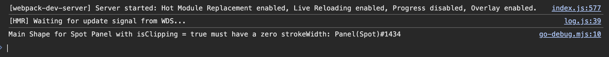
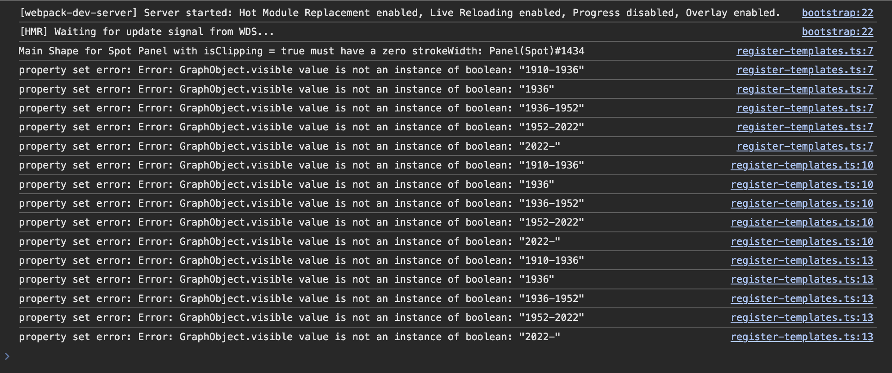

# Debugging

## Intro

Debugging your code is an inseparable part of every app development process. In
this lesson, we'll familiarize ourselves with several methods and tools for
debugging GoJS applications. These will be: tools provided by GoJS
developers themselves (go-debug, template debugging tutorial), tools created
here at Synergy Codes (chrome extension) as well as some tips and best practices we've
learned while working with GoJS over the years. In the process, we will fix some
bugs and add some small improvements to the existing application code.

## What you'll learn

* Using go-debug version of the GoJS library
* Exposing diagram instance
* Exploring diagram properties and collections
* Templates and internal GoJS code debugging methods
* Using GoJS chrome extension (TODO)

## go-debug.js

The GoJS library creators provide a special version designed for the development process. This version, `go-debug.js`, is included in the package when you install GoJS via npm. It automatically loads when your project is in development mode (e.g., in webpack, `mode: "development"`). This debug version performs additional error checks and provides more detailed warnings compared to the regular version.

Since we are in development mode, let's examine the console output.




It seems there is an issue with the photo panel. The error message is quite descriptive, allowing us to identify the exact problem. However, before addressing this, let’s revisit the homework from Lesson 2. We were tasked with implementing a panel featuring a crown that appears when a family member has years of reign specified. 

Let’s assume we want to control the `visible` property using the following binding:

```typescript
// node-template.ts
//...
const crownIcon = () =>
  $(
    go.Picture,
    {
      source: CROWN_ICON,
      //...
      visible: false,
    },
    new go.Binding("visible", "reign")
  );
```

Now, let’s check the app. You’ll notice that the crown is not visible, and the console shows the following messages:



These messages indicate a problem with setting the `visible` property on certain graph objects in the diagram. Specifically, they highlight that the value assigned to `visible` is a string instead of a boolean, which is causing the issue.

Next, let’s change the mode in webpack to production by setting `mode: "production"` and rebuilding the app.

Once rebuilt, everything should work as expected: the crown will be visible, and no error messages (including the one about the photo panel) will appear in the console.

In the production version, additional type-checking is skipped, so string values are implicitly cast to and interpreted as "truthy." However, in `go-debug` mode, an error is thrown, and the invalid value is not assigned to the binding. This highlights the importance of proper type alignment, especially during development.

Now, let’s switch back to development mode in webpack (`mode: "development"`) and fix the issue with the photo panel by setting the `strokeWidth: 0` and reversing the `crownIcon` to match your implementation.

## Exposing diagram instance

Having diagram instance exposed in the developer console can be one of the most
useful tools when debugging and testing GoJS behavior.

To do it, let's add a following code snippet to the `index.ts` file.

```typescript
// index.ts
//...
window.addEventListener("load", () => {
  //...
  (window as any).goJsDiagram = diagram;
});
```

After opening developer tools, we can now type `goJsDiagram` in the console, and receive diagram instance.


Similarly to the go-debug, we wouldn't want to expose that variable in the
production build. In the actual application, if we needed such an instance for
development, this assignment would probably be hidden behind some condition,
checking whether we are in dev build or prod one.

As for the diagram instance: having it in the console allows us to have
programmatic access to GoJS API during runtime. So, we can test different
diagram settings and behaviors; navigate through graphObject trees without
having to modify code and rebuild application.

Let's see an example:

One of the features that we have built so far is the ability to create new
family members on the diagram and link them into the existing tree. To achieve
that so far, we've used default GoJS linkingTool with its' default settings. If
you play more with that linking behavior, you may find it's not perfect in all
situations. For example, if you add multiple family members, they will get
positioned quite close to each other. When you want to link them, you'll see
that link will snap almost immediately to a node next to where we started
drawing it, even if we may have wanted to connect it to a completely different
one.

If you take a look at GoJS documentation, you may find that there is a property
that influences snapping distance for the linking
tool: [portGravity](https://gojs.net/latest/api/symbols/LinkingBaseTool.html#portGravity)
. Setting a lower value during diagram initialization is quite easy, but how do
we find the right value? Here having a diagram instance for debugging can be
quite useful. Let's just access the link tool through the exposed diagram
instance and assign different portGravity value to our tool.

```
> goJsDiagram.toolManager.linkingTool.portGravity = 50;
```

Right after executing this piece of code, we can see the tool behaving
differently, without our app having to reload.

Try playing with it and finding the correct value. We've ended up
with something like 30, so that's what we'll put in the following code snippet, that we can now include in our `diagram.ts` file responsible for such configuration.

```typescript
// iagram.ts
//...
export const createDiagram = (diagramDiv: HTMLDivElement) => {
  //...
  diagram.toolManager.linkingTool.portGravity = 30;

  return diagram;
};
```

## Exploring diagram props and collections

Once we have access to a diagram instance, following the documentation on
diagram API, we can access every object and property the diagram consists of.
Let me walk you through a couple of the most useful ones.

In previous lessons, we've encountered nodeDataArray/linkDataArray already. They
are the source of data for our diagram's nodes and links. We can preview them
easily in the console by typing either: `> goJsDiagram.model.nodeDataArray`
or `> gojsDiagram.model.linkDataArray`. Besides those arrays on the diagram
model, we can also find so-called modelData: `> goJsDiagram.model.modelData`.

What are they useful for in debugging? The answer is: bindings. With access to
these arrays and their objects we can quickly check how the bindings behave with
different data, without having to prepare an entire test dataset.

Let's use this to check something in our application.

In earlier lessons, we created node templates containing a circle with a picture of a person. When a URL for the picture is provided, the photo is displayed. Otherwise, one of the default pictures is shown, depending on the person's gender. The relevant binding in your code should look something like this:

```typescript
//node-template.ts
//...
const photo = (size: number) =>
  $(
    go.Panel,
    go.Panel.Spot, 
    //...
    $(
      go.Picture,
      //...
      new go.Binding("source", "photo", (photo, obj) =>
        getPhoto((obj.part.data as FamilyMember).gender, photo)
      ),
      new go.Binding("source", "gender", (gender, obj) =>
        getPhoto(gender, (obj.part.data as FamilyMember).photo)
      )
    )
  );
//...
```

But what happens if there is a photo in the node's model, but it's an invalid
url? Let's select a family member on the diagram with a picture and access its
data from the console.


Actually, we used `diagram.selection` instead of filtering
through `nodeDataArray`. Using selection is quite helpful in debugging as it's
quicker to check some object properties that way. Selection will contain a GoJS
collection of selected objects; on each of them, there will be a data property
that points to an object in `nodeDataArray` that is the source of data for that
node. We will talk about GoJS collections in a minute, but first, let's check
the binding.

If we try to modify node's data directly

```
goJsDiagram.selection.first().data.photo = 'invalidUrl'
```

We'll see that nothing changed in the diagram. But the data in `nodeDataArray`
was actually changed. So what happened? If we place the debugger breakpoint on
the binding's conversion function and try to make another change, we'll see that
it hasn't been executed. This has to do with how the GoJS bindings work. GoJS
isn't observing changes on node data array objects, so something has to tell
them to execute the bindings. We could
call [updateTargetBinding](https://gojs.net/latest/api/symbols/Panel.html#updateTargetBindings)
manually, but actually, the preferred way of setting object properties is to
use [setDataProperty](https://gojs.net/latest/api/symbols/Model.html#setDataProperty)
or just [set](https://gojs.net/latest/api/symbols/Model.html#set) on the model.

```
goJsDiagram.model.set(goJsDiagram.selection.first().data, 'photo', 'anotherInvalidUrl')
```

Now, we should see that the photo disappeared, and we've got 404 error in the
console. Still, the photo disappeared entirely, leaving just a blank circle.
What we'd like to do is to have default fallback photos being used in such a
situation. In the documentation, you can find that the Picture class has just
the right property for
it: [error function](https://gojs.net/latest/api/symbols/Picture.html#errorFunction)
.

We can assign there any function to be executed when an image set by
the `source`
property fails to load for whatever reason. If we add the following code to our
picture's template.

```typescript
//node-template.ts
//...
const photo = (size: number) =>
  $(
    go.Panel,
    go.Panel.Spot,
    //...
    $(
      go.Picture,
      {
        //...
        errorFunction: (picture: go.Picture) => {
          const data = picture.part.data as FamilyMember;
          picture.source = data.gender === "F" ? WOMAN_AVATAR : MAN_AVATAR;
        },
      },
      //...
    )
  );
//...
```

And try to break the url again. We will now see the default female photo
appearing instead.


Now let's talk about GoJS collections. If you've played with GoJS API you'd
probably already noticed, that many GoJS objects are using collections based on
GoJS [Iterable](https://gojs.net/latest/api/symbols/Iterable.html) interface
instead of javascript arrays. `diagram.selection` we just accessed
or `diagram.nodes`/`diagram.links` are examples of such collections. When
developing or debugging GoJS this can actually be quite annoying. Classes
derived on that interface usually have all the needed methods, but they can be
named differently from the same js arrays methods. Thankfully
GoJS's [List](https://gojs.net/latest/api/symbols/List.html)
and [Set](https://gojs.net/latest/api/symbols/Set.html) contain `toArray()`
method we can use to transform them into a regular array.

When navigating through GoJS objects in the console, you'll also encounter a lot
of these 2 letter long properties and methods. These result from code
minification, and you can just ignore them. Typing any property or method name
available in the API documentation will work fine and give you access to
anything you need.

## Templates debugging

Another very common use case when a lot of debugging can be needed is designing
node/group templates and positioning elements in panels. In this case, however,
GoJS documentation itself provides a couple of reasonable suggestions with an
example. So as a part of this lesson we recommend you to read
it. [Debugging node panel designs](https://gojs.net/latest/intro/debugging.html#DebuggingNodePanelDesigns)

## Debugging internal GoJS code

Since the GoJS library provides only minified code, it can be pretty difficult
to figure out what happened when we encounter some exceptions. Especially that
the error we'll see can often be something
like `Cannot read property 'jX' of undefined'`. In cases like these, there are
some tips that might be useful.

While we cannot easily debug the exact line where the error happened, we can
often narrow it down to the general function in which it occurred. Gojs is a
very extensible library where we can override the behavior of almost every
method in every class, diagram, tool, layout or animation. For instance

```typescript
import * as go from 'gojs';

export class DraggingTool extends go.DraggingTool {
 //...
}
```

Overriding different GoJS methods just to allow us to put a breakpoint
there or log the results can be very useful when trying to understand where the
error actually happens. In GoJS documentation, you can often find useful
information about tools, or layouts lifecycle that can help us understand which
method is called by which other method.

## Chrome extension

As you've seen since the start of this lesson, debugging GoJS can sometimes be
quite cumbersome. To make some of it more accessible, we've developed a chrome
browser extension here at Synergy Codes.

Let's install it and go through a couple of its features.

You can find the extension here https://www.synergycodes.com/community 

After you've installed it and opened developer tools, you should see a GoJS tab.


One of the main features of the extension is the ability to inspect diagram
graph objects in a similar way that you can inspect HTML elements on the page
with the standard browser devtools. When you select the inspect button, and
hover over different diagram elements, you should see them being highlighted
with a tooltip indicating their type and size.


This can be a handy feature when working on node templates and may save you some
time with brute force methods like coloring panels and other objects, as
presented in GoJS tutorial on panel debugging.

After selecting such an element, the entire diagram tree of objects will be
displayed in the devtool. On the right-hand side panel, you'll be able to easily
check all properties of such object.


Right now, it's impossible to modify these properties directly from the devtool
as you can do with styles of HTML elements in devtool. There might be such a
feature in the future, but right now, interacting directly with the diagram API
from the console is still needed.

GoJS chrome extension also handles the "exposing diagram instance" part earlier
from this lesson, as inspected diagram will be available in the console
as `$diagram` variable. You can also create a global variable out of every
diagram object visible in the inspected diagram tree.

Still, exposing the diagram manually might be useful in some cases (like
debugging an application with a different browser than chrome - since these are
not yet supported by the extension) so it was included in this tutorial anyway.

## Summary

In this lesson, we've learned about different tools and methods available for
GoJS debugging and the most common use-cases when such debugging is needed. This
is, of course, not a complete guide as debugging, in general, is a very broad
topic. Still, with tips and tools we've learned about in this lesson combined
with reading the documentation, you should be able to resolve most problems you
may encounter while working with GoJS.

## Homework

For this lesson's homework, try to implement the following feature for the
diagram:

In the group template add a panel that will display the number of family members
within that group. This panel should be positioned below the group title and
aligned to the right side of that title.


The additional requirement is that if the group title is wider than the group
container, the panel should adjust its position to the corner of the group
container, so it won't overlap with its border.


> Hints:
> * Try to finish the first part of the task before moving on to the additional requirement
> * `alignment`/`alignmentFocus` properties, and `ofObject()` bindings might be useful in this task
> * naming your main shape and group title panel and referencing them in bindings might be useful
> * You should be able to finish this task without changing the main shape and its relation with the group's placeholder, but of course there are multiple ways to complete this task
