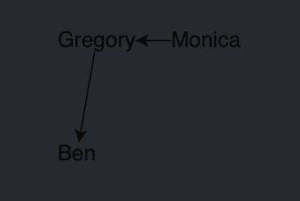

# Creating a diagram instance

## Intro
In this lesson, we'll create our first GoJS diagram.

## Lesson Objectives
* How to create a GoJS diagram
* What is a diagram model
* How to add node and link templates
* What is a diagram layout
* How to save and load a diagrams model

## Instantiating a GoJS diagram
Currently our application doesn't look spectacular. Let's spice things up by creating our very first diagram.

First create a directory named `gojs` in `src`.
Then in the `gojs` directory add a directory named `diagram` with a file named `diagram.ts`.
Your project structure should look like this:

```
src/
  gojs/
    diagram/
      diagram.ts
```

Then in `diagram.ts` add the following code:

```typescript
// diagram.ts
import * as go from "gojs";

export const createDiagram = (diagramDiv: HTMLDivElement) => {
  const diagram = go.GraphObject.make(go.Diagram, diagramDiv);
  return diagram;
};
```

First, we import GoJS.
In the `createDiagram` function we accept a parameter referencing the div which will hold our diagram.
Then, we create the diagram by calling `go.GraphObject.make` and passing the diagram class along with the div.

Finally, let's add the diagram to our app.
Add the following to the `index.ts`:

```typescript
// index.ts
// ...
import { createDiagram } from "./gojs/diagram/diagram";

window.addEventListener("load", () => {
  // ...
  const diagram = createDiagram(diagramDiv);
});

```

If you look at the app you should see that our div has a GoJS diagram associated with it.
This is indicated by a watermark in the top left corner.
Great!

One last thing before we go further.
The `go.GraphObject.make` function is used a lot within GoJS.
To improve readability and speed up development, let's assign it to something shorter.
A common way is to assign it to a constant variable named `$`.

In `diagram.ts`, replace the current code with:

```typescript
// diagram.ts
import * as go from "gojs";

const $ = go.GraphObject.make;

export const createDiagram = (diagramDiv: HTMLDivElement) => {
  const diagram = $(go.Diagram, diagramDiv);
  return diagram;
};
```

From now on, in the tutorial, we'll stick to this practice. You will shortly see why.
## Data model
All right! We've successfully created a diagram.
But other than displaying a watermark, there's not much going on.
Let's change that quickly by feeding our diagram with some data.

In the `diagram` directory, create another file named `add-model.ts`. In that file add:

```typescript
// add-model.ts
import * as go from "gojs";

export const addModel = (diagram: go.Diagram) => {
  diagram.model.nodeDataArray = [
    { name: "Gregory" },
    { name: "Monica" },
    { name: "Ben" },
  ];
};
```

Then use it in `diagram.ts` like this:

```typescript
// diagram.ts
//...
import { addModel } from './add-model';
//...
const diagram = $(go.Diagram, diagramDiv);
addModel(diagram);
//...
```

Now check the app, it should look like this:


We've added our first nodes, awesome!
Now you can play a bit with the diagram.
Try to move the nodes around or pan the diagram before we go further.

### What happened there?

The model holds essential data of a diagram. It doesn't specify what things look like, only what their properties are.
Each object from the `nodeDataArray` is then converted into a node and placed onto the diagram.

### And what about links?

We're glad you asked. The default model doesn't allow linking nodes.
For that, we have to change the default model into `GraphLinksModel`.

In `add-model.ts`, assign it in place of the default model:

```typescript
// add-model.ts
//...
export const addModel = (diagram: go.Diagram) => {
  const model = new go.GraphLinksModel();
  model.nodeDataArray = [
    { name: "Gregory" },
    { name: "Monica" },
    { name: "Ben" },
  ];
  diagram.model = model;
};
```

Before we add any links, we have to add keys to the nodes.
Every node has its unique key which we can use to identify them.
If we don't assign the keys manually, GoJS will generate them for us.
That wasn't a problem before since we didn't do anything with the nodes, but links need to know what nodes they attach to.

Simply replace the current `nodeDataArray` with:

```typescript
// add-model.ts
//...
  model.nodeDataArray = [
    { key: 0, name: "Gregory" },
    { key: 1, name: "Monica" },
    { key: 2, name: "Ben" },
  ];
//...
```

Now let's actually create the links.
After changing the model to `GraphLinksModel` we can add them via the `linkDataArray` property of the model.
The simplest link data object only needs to have two properties: `from` and `to`, which are set to the keys of corresponding nodes.
Let's say we want to have a link from `Gregory` to `Ben` and from `Monica` to `Gregory`.

The `linkDataArray` should look as follows:

```typescript
// add-model.ts
//...
  model.linkDataArray = [
    { from: 0, to: 2 },
    { from: 1, to: 0 },
  ];
//...
```

How it should look like in the app:



Now we know how to add nodes and links. Let's try to style them a bit.

## Templates

Until now, we haven't specified what our nodes and links should look like.
By default nodes are simple text fields and links are straight arrows. How to create templates will be explained in the next lessons.
Let's just have a quick glimpse at what they actually are, and how to use them.
In the `gojs` directory create a new folder named `templates`.
In that directory create a file named `node-template.ts` and paste this code:

```typescript
// node-template.ts
import * as go from "gojs";

const $ = go.GraphObject.make;

export const createNodeTemplate = () =>
  $(
    go.Node,
    { background: "lightgreen" },
    $(go.TextBlock, { margin: 10 }, new go.Binding("text", "name"))
  );

```

In the same directory create another file named `link-template.ts` and paste in:

```typescript
// link-template.ts
import * as go from "gojs";

const $ = go.GraphObject.make;

export const createLinkTemplate = () =>
  $(
    go.Link,
    { routing: go.Routing.Orthogonal },
    $(go.Shape, { stroke: "white" })
  );

```

You don't need now to know what all this code means, only that it describes what our nodes and links should look like.
Also, you can see how assigning `go.GraphObject.make` to something shorter starts to come in handy :).

To make GoJS use these templates in our app, let's first create a file in the `diagram` directory named `register-templates.ts`.

In that file add:

```typescript
// register-templates.ts
import * as go from "gojs";

import { createLinkTemplate } from "../templates/link-template";
import { createNodeTemplate } from "../templates/node-template";

export const registerTemplates = (diagram: go.Diagram) => {
  diagram.nodeTemplateMap = new go.Map([
    { key: "", value: createNodeTemplate() },
  ]);
  diagram.linkTemplateMap = new go.Map([
    { key: "", value: createLinkTemplate() },
  ]);
};
```

>`Map` is the GoJS equivalent of a collection of key-value pairs.

Now, we have to make the diagram use them:

```typescript
// diagram.ts
//...
import { registerTemplates } from "./register-templates";
//...
export const createDiagram = (diagramDiv: HTMLDivElement) => {
  //...
  registerTemplates(diagram);

  return diagram;
};
```

This registers the templates.
From now on, GoJS will use them to create our nodes and links.

Now it looks much better!:


Why are the keys empty strings?
By default, when creating nodes, GoJS looks for the category property of an object in the `nodeDataArray`.
If it doesn't find one, it uses the default template with an empty string as the key.
If you're using only one type of node or link you can set nodeTemplate/linkTemplate instead of creating a whole Map, but in the end GoJS still creates it.
It's syntactic sugar for creating a one-element Map with an empty string as the key.

Example:

```typescript
nodeDataArray = [
  { name: "Gregory", category: "father" },
  { name: "Monica", category: "mother" },
];
...
diagram.nodeTemplateMap = new go.Map([
  { key: "father", value: createFatherNodeTemplate() },
  { key: "mother", value: createMotherNodeTemplate() },
]);
```

In this example, Gregory and Monica nodes would be created using different templates.
More on categories and templates in the next lessons.


## Layouts
In this example, we're going to create the British Royal family tree. All data has already been prepared.
To use them, we have to import them in `add-model.ts` and replace the current data arrays as such:

```typescript
// add-model.ts
//...
import { links, nodes } from "../../data/data";

export const addModel = (diagram: go.Diagram) => {
  const model = new go.GraphLinksModel();
  model.nodeDataArray = nodes;
  model.linkDataArray = links;

  diagram.model = model;
};
```
The app should look like this:


Woah, that's messy. If only we could make the nodes resemble a tree without having to position them manually.

GoJS already has an answer: Layouts.

Layouts take care of positioning the nodes.
GoJS has many built-in layouts which work well for popular data structures including, you guessed it, trees.

To get a nice tree, all we have to do is to change the default layout to a `TreeLayout`.
In the `diagram` directory create a file named `add-layout.ts` and paste in:

```typescript
// add-layout.ts
import * as go from "gojs";

export const addLayout = (diagram: go.Diagram) => {
  const layout = new go.TreeLayout();
  diagram.layout = layout;
};
```

Then use it in `diagram.ts`:

```typescript
// diagram.ts
//...
import { addLayout } from "./add-layout";
//...
export const createDiagram = (diagramDiv: HTMLDivElement) => {
  //...
  addLayout(diagram);

  return diagram;
};
```

Okay, looks way better! But a family tree goes from top to bottom, not from right to left, let's fix that.
In `add-layout.ts`, change the angle of the layout:

```typescript
// add-layout.ts
//...
export const addLayout = (diagram: go.Diagram) => {
  //...
  layout.angle = 90;
  //...
};

```

Our result should look like this:


Layouts have a lot of customizability, we can even add custom behaviors by extending any layout class.
But that's a topic for a separate lesson.
For more information regarding layouts click [here](https://gojs.net/latest/api/symbols/Layout.html)

## Saving the diagram

The last thing we will learn today is how to save and load the diagrams model.
In the `index.ts` let's handle onclick event for save and load buttons:

```typescript
// index.ts
//...
import * as go from 'gojs';

window.addEventListener("load", () => {
  //...
  saveButton.onclick = () =>
    localStorage.setItem("diagram", diagram.model.toJson());
  loadButton.onclick = () =>
    (diagram.model = go.Model.fromJson(localStorage.getItem("diagram")));
});
```

And that's it.
The Model class has a convenient method `toJSON` for serializing the model into a string.
Together with `fromJSON`, saving and loading a model is as simple as it gets.
Save the diagram, remove a node (with backspace), then load the diagram and you will see that the diagram goes back to its previous state.
## Summary

That was a lot!
We went from just a skeleton to having a nice tree representing a real family.
We learned how to create a diagram, what models and layouts are, how to add templates, and at last how to save the model.
In the next lesson, we will dive deeper into templates.
We'll learn what their building blocks are and how we can create complex nodes instead of a simple text in a box.
## Homework

For homework, try to come up with a solution on how to load the saved model at startup.
In other words, if there's a model present in `localStorage` use it instead of the data from the file.
