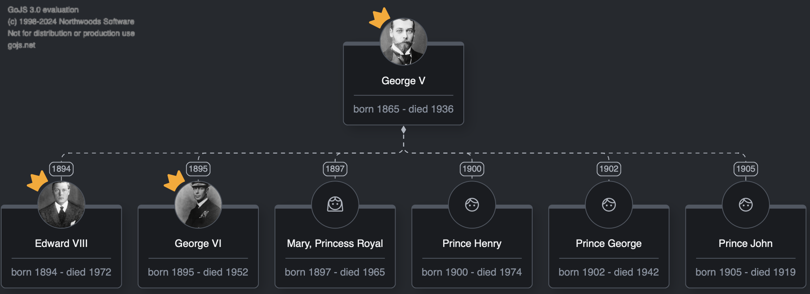
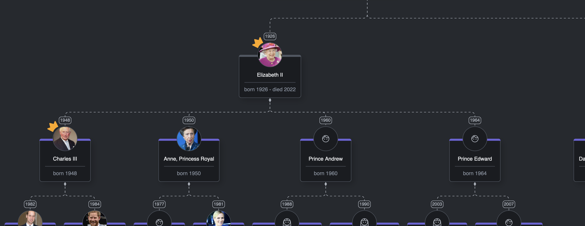
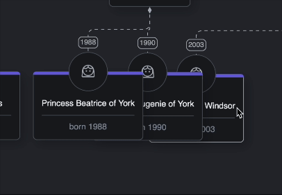

# Layers and ZOrder

## Intro

Any 2D visualization environment introduces the concept of z-ordering—deciding which of the multiple overlapping 2D objects appears on top of the others. GoJS follows this principle by providing **Layers** and the **zOrder** property for its parts. In this lesson, we'll explore how GoJS implements z-ordering and how we can use it to gain greater control over the display of various diagram objects.

## What you'll learn

* What are GoJS's Layers and zOrder
* What you can use them for, and for what you can't
* How Layers are utilized by the library other features
* How to implement simple feature using them

## GoJS Layers

GoJS incorporates the concept of [Layers](https://gojs.net/latest/api/symbols/Layer.html) into its diagrams. Each [Part](https://gojs.net/latest/api/symbols/Part.html) of the diagram belongs to a specific layer, and all layers are arranged in a predefined order. Parts within a layer are drawn on top of parts from layers that appear earlier in this order.

## Usage and limitations

It might be tempting to use GoJS's **zOrder** concept to control which shape is displayed on top of another within a node template. However, **GoJS's Layers and zOrder apply only at the part level**—meaning you can adjust the zOrder of an entire Part (Node or Link), but not an individual GraphObject within that part.  

For individual GraphObjects within a template, the rendering order is determined by the structure of the template and the order in which the shapes are defined or added programmatically. In cases where shapes overlap within the same panel, the shape defined later in the template (or added later) will appear on top of the earlier ones.  

Layers, on the other hand, offer properties that can be customized to affect all parts in the layer. This provides a way to easily control the appearance and behavior of multiple nodes or links simultaneously.  

## Example

Let's see an example and implement it in our app:

In previous lessons, we created group templates to organize parts of the royal family. Now, let’s implement a toggle that allows us to hide the groups themselves while keeping their member nodes visible. This can be particularly useful when generating an image of the diagram — a feature we explored in Lesson 8 of this course.

One way to control the visibility of all groups is by assigning them to a specific layer and modifying that layer’s properties.

First, let's create a new Layer on the diagram by adding `addLayers.ts` file in
the `diagram` directory with the following contents:

```typescript
//add-layers.ts
import * as go from "gojs";

const $ = go.GraphObject.make;

export const addLayers = (diagram: go.Diagram) => {
  const backgroundLayer = diagram.findLayer("Background");
  diagram.addLayerAfter($(go.Layer, { name: "GroupLayer" }), backgroundLayer);
};
```

and call the function during the diagram initialization:

```typescript
//diagram.ts
//...
import { addLayers } from "./add-layers";
//...
export const createDiagram = (diagramDiv: HTMLDivElement) => {
  //...
  addLayers(diagram);
  registerTemplates(diagram);
  //...
  return diagram;
};
```
In the code, we first find an existing layer on the diagram and then create a new layer, positioning it above the original layer using the `addLayerAfter()` method.  

Each layer in a diagram has a specific order, determining which layer is drawn on top of another. Standard GoJS layers include: "Grid," "Background," the default layer (""), "Foreground," "Adornment," and "Tool." You can learn more about these layers in the GoJS [documentation](https://gojs.net/latest/intro/layers.html).  

By calling `addLayerAfter()` with the Background layer as an argument, we ensure that the new layer is positioned in the hierarchy between the Background layer and the default layer, where nodes and links are typically placed. To view the order of layers, you can iterate over the `diagram.layers` property.  

To place all of our groups on the newly created layer, we can define `layerName`
in the group template:

```typescript
//group-template.ts
//...
export const createGroupTemplate = () =>
  $(
    go.Group,
    go.Group.Spot,
    {
      //...
      layerName: "GroupLayer",
      //...
    },
    //...
  );
```

Let's create a function to toggle group visibility, utilizing the introduced layer.

```typescript
//toggle-groups.ts
import * as go from "gojs";

export const toggleGroups = (diagram: go.Diagram) => {
  const groupLayer = diagram.findLayer("GroupLayer");
  groupLayer.visible = !groupLayer.visible;
};
```

```typescript
//index.ts
//...
import { toggleGroups } from "./gojs/utils/toggle-groups";

window.addEventListener("load", () => {
  //...
  toggleGroupsButton.onclick = () => toggleGroups(diagram);
  //...
});
```

Now if you click the "Toggle Groups" button you might see something interesting. Instead of
hiding just the group themselves, group contents also disappeared.



Does this mean that nodes inside the group ended up on the group layer we just hid? Actually, no. This behavior relates to how GoJS groups function. When the visibility of a group changes, it also affects all members of its subgraph, even if those members are drawn on a different layer.

To achieve our goal of hiding only the groups while keeping their nodes visible, we need a different approach. Let’s modify the code in the toggle function:

```typescript
//toggle-groups.ts
//...
export const toggleGroups = (diagram: go.Diagram) => {
  const groupLayer = diagram.findLayer("GroupLayer");
  groupLayer.opacity = groupLayer.opacity ? 0 : 1;
};
```
Opacity is another property we can adjust, which applies to all parts on a layer. In this case, it’s exactly what we need. Modifying the opacity ensures the group remains under the nodes, allowing us to interact with it - for instance, to grab and move it. While this behavior might be undesirable in some scenarios, it works well for our goal of hiding groups for image export purposes.



You can explore all the properties that can be modified on a layer in the [documentation](https://gojs.net/latest/api/symbols/Layer.html).

## Layers' other features

In addition to determining the drawing order and enabling property modifications for all parts in a layer, **GoJS Layers** can be categorized into two types: **temporary** and **permanent**. A temporary layer is defined by setting its [isTemporary](https://gojs.net/latest/api/symbols/Layer.html#isTemporary) property to `true`. Graph objects in temporary layers exhibit specific behavior by default:  

- They are not selectable.  
- They are excluded from bounds calculations.  
- Changes to them are not recorded in the undo manager.  
- They do not receive click events.  

GoJS utilizes this behavior extensively. For example, parts created by tools, such as selection adornments, are placed on their corresponding standard layers like "Tool" or "Adornment." Temporary layer behavior is then applied to these parts automatically.  

This design allows GoJS to efficiently implement features such as:  
- Nodes created under the cursor by the dragging tool always appear on top of other diagram objects.  
- Changes to nodes during drag operations are excluded from the undo-redo stack.  

## ZOrder

In GoJS, each part has a [zOrder](https://gojs.net/latest/api/symbols/Part.html#zOrder) property. By default, this property is set to `NaN`. If a specific number is assigned to the `zOrder`, parts with higher values will be rendered on top of parts with lower values. This behavior is similar to the CSS [z-index](https://developer.mozilla.org/en-US/docs/Web/CSS/z-index), but it only applies to parts within the same layer.

As a result, the rendering order of parts is determined first by the **index of the layer** and then by the **zOrder** of the part within that layer.

When a part’s `zOrder` is not set (i.e., its value remains `NaN`), GoJS guarantees that group parts will always be rendered below their member parts within the same subgraph. However, for two parts overlapping on the same level, GoJS does not guarantee which one will appear on top. In practice, the part that was added to the diagram later will be the one rendered on top.

## Summary

In this lesson, we learned about the GoJS concepts of Layers and zOrder. Besides determining which part will be rendered on top of another in case of overlaps, Layers also allow us to control various other behaviors of the parts on them.

## Homework

In the app, right now we can drag nodes to make them overlap one another.
However, since zOrdering hasn't been set in any of the previous features, the
node on top will usually be the last one added to the diagram.

As a homework, implement following feature:

When selecting a node, ensure that it is brought to the top of any overlapping nodes and remains on top when the selection changes.

Result should look something like this:


