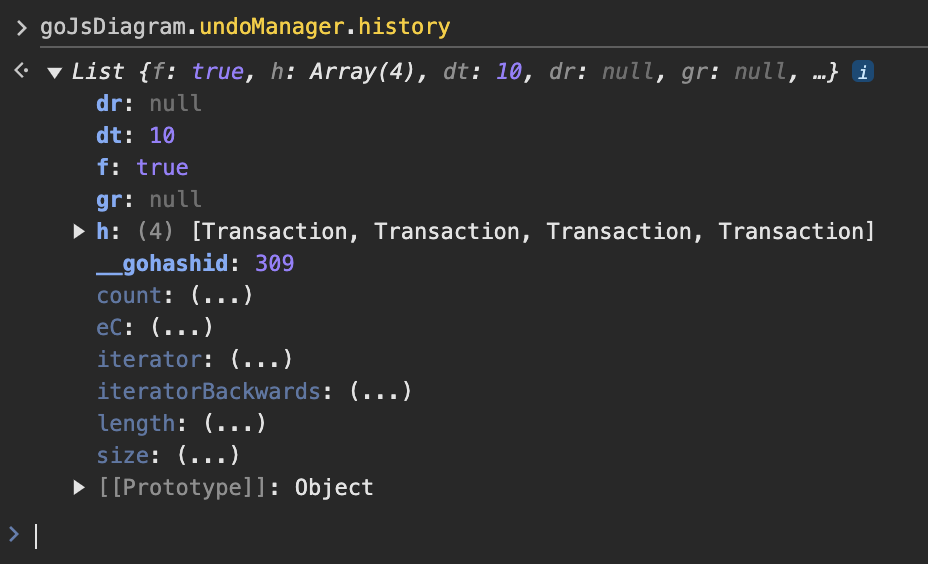
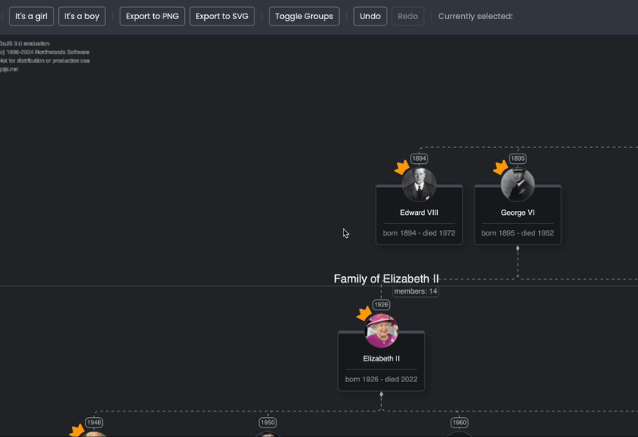
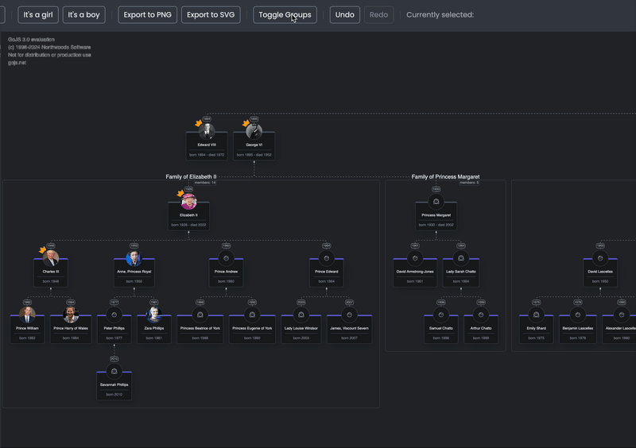
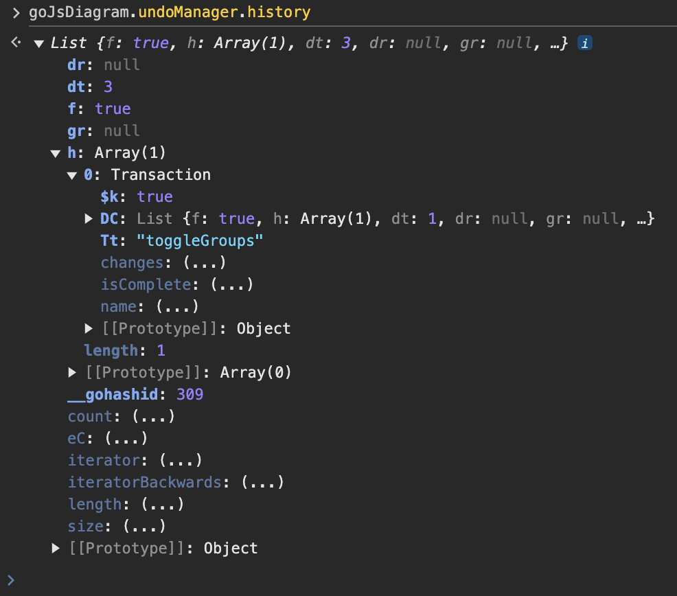
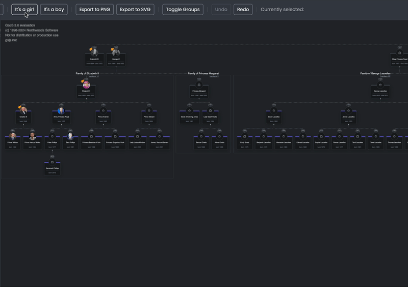
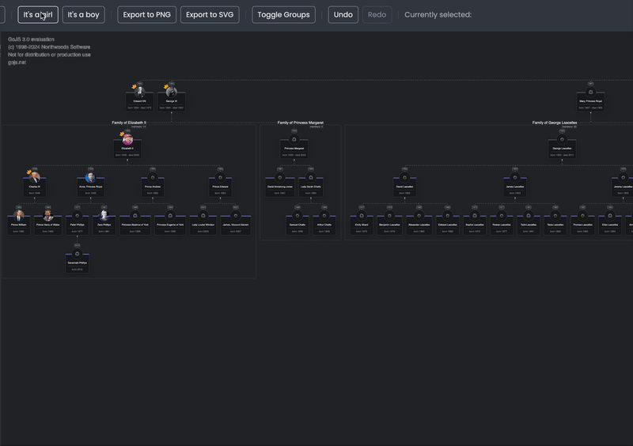

# Undo Manager

## Intro

In any editor, being able to undo and redo your changes is a basic and standard
functionality. When talking about interactive diagrams like the ones we can
build in GoJS, this is no different. Fortunately, the library with its
UndoManager offers a pretty good support for registering diagram actions and
undo-redo actions. In this lesson, we'll learn how to utilize GoJS's UndoManager,
the necessary steps to use it, best practices we can follow while
using it and how to extend its behavior.

## What you'll learn

* How the GoJS undo manager works
* What GoJS transactions are and how to use them
* Best practices while working with GoJS UndoManager

## Basics

An [UndoManager](https://gojs.net/latest/api/symbols/UndoManager.html) observes
and records model and diagram changes in transactions and supports undo/redo
operations. By default, UndoManager is disabled. Let's start by enabling it in
our app:

```typescript
//diagram.ts
//...
export const createDiagram = (diagramDiv: HTMLDivElement) => {
  //...
  diagram.undoManager.isEnabled = true;

  return diagram;
};
```

As you can see, we can access the UndoManager instance on the diagram. When
the isEnabled flag is set, UndoManager will start recording model changes. You
can test this by adding a new node to the diagram (drag & drop from the palette,
or using "It's a girl/boy" buttons) and clicking CTRL+Z.

The result you should see is the added node being removed from the diagram. By
clicking CTRL+Y, you should be able to redo the undone operation, and the node
should reappear in the diagram.

If you access
the [history](https://gojs.net/latest/api/symbols/UndoManager.html#history)
property in the console, you should see a list of transactions recorded by the
UndoManager.



To see our current place in the history after undoing/redoing some
changes you can view
the [historyIndex](https://gojs.net/latest/api/symbols/UndoManager.html#historyIndex)
. While accessing this list and the current index is usually not necessary for
features themselves, it can prove quite useful in debugging features related to
UndoManager.

One of the common features available in various editors, besides being able to
undo and redo changes, is having undo/redo buttons that also show whether we can
undo or redo any change in any given moment.

Let's try implementing it in our app!

First, we'll create a file `undo-redo.ts` in the `utils` folder:

```typescript
//undo-redo.ts
import * as go from "gojs";

export const undo = (diagram: go.Diagram) => {
  diagram.commandHandler.undo();
};

export const redo = (diagram: go.Diagram) => {
  diagram.commandHandler.redo();
};
```

Next, let's implement handlers:

```typescript
//index.ts
//...
import { redo, undo } from "./gojs/utils/undo-redo";
//...
window.addEventListener("load", () => {
  //...
  undoButton.onclick = () => undo(diagram);
  redoButton.onclick = () => redo(diagram);
  //...
});
```

In the undo/redo functions, we
used [`diagram.commandHandler`](https://gojs.net/latest/api/symbols/CommandHandler.html)
instead of `diagram.UndoManager` to call undo() and redo(). This is to ensure
that the undo/redo button actions will have exactly the same results as using
CTRL+Z/CTRL+Y actions. In GoJS, by default most of the user interactions are
interfaced through CommandHandler, and it is good practice to implement any
custom features the same way. For undo and redo actions, while CommandHandler
calls the actual UndoManager in its undo/redo implementation, there are
additional checks and conditions. For example, a check whether the diagram is
readonly before trying to undo any action.

Now, with the undo/redo buttons in our app added, the next step will be to
ensure that they change their state depending on whether there are any actions
the user can undo or redo. Right now, the buttons are always enabled.

One possibility is to
use [canUndo()](https://gojs.net/latest/api/symbols/UndoManager.html#canUndo)
and [canRedo()](https://gojs.net/latest/api/symbols/UndoManager.html#canRedo)
methods available on UndoManager. Or rather, to keep with the best practices
from the previous paragraph, canUndo() and canRedo() from
the [CommandHandler](https://gojs.net/latest/api/symbols/CommandHandler.html).

Still, while these methods allow us to check whether we can undo or redo changes
in any given moment, we need to call them manually and we need to know when to
call them. Unfortunately, there is no observable property, nor any event emitted
on the UndoManager that would always trigger whenever that state changes.
Fortunately, there are other events that we can listen to, which should be
sufficient for our use case.

Since we know that UndoManager listens for changes in transactions
specifically (we will learn more about transactions in the next section), we can
add a listener that will trigger whenever a transaction has been committed to
the diagram.

We will add this event listener in the `register-listeners.ts` file.

```typescript
//register-listeners.ts
//...
const handleUndoRedo =
  (diagram: go.Diagram) =>
  (event: go.ChangedEvent): void => {
    if (!event.isTransactionFinished) {
      return;
    }

    const { undoButton, redoButton } = pageElements;

    undoButton.disabled = !diagram.commandHandler.canUndo();
    redoButton.disabled = !diagram.commandHandler.canRedo();
  };

export const registerListeners = (diagram: go.Diagram) => {
  //...
  diagram.model.addChangedListener(handleUndoRedo(diagram));

  return () => {
    //...
    diagram.model.removeChangedListener(handleUndoRedo(diagram));
  };
};
```

If you examine the above code carefully, you'll notice that we've
used [`model.addChangedListener()`](https://gojs.net/latest/api/symbols/Model.html#addChangedListener)
here. In [lesson 6](lesson-6-diagram-events.md) we learned about Diagram
events already. Model changed events, however, were only briefly mentioned. If
you'd like to learn more about them, you may want to read the 
GoJS [introduction page](https://gojs.net/latest/intro/changedEvents.html#ModelAndDataChanges).

For this feature, we'll just make use of one useful property available on
the `ChangedEvent` class, which tells us whether a given change was a
transaction: `isTransactionFinished`.

Now, after making some diagram changes then undoing and redoing them, you should
see the undo/redo buttons state updated correctly.



As you've probably noticed, not all changes to the diagram are registered in the
UndoManager. For example, the selection of a node or a link is not registered. This is quite
understandable, in the same way it wouldn't make sense to register caret position
or a selection in a text editor. Still, selecting a given node is a change to the
diagram. If we added a specific binding, this would be a change to the diagram model
as well. So, how does GoJS know which changes should be registered in undo
and which shouldn't?

Assuming that UndoManager is already enabled, it will register any model
changed events. The most basic way of ensuring that a change will raise its model
changed event is to
use the [model.setDataProperty()](https://gojs.net/latest/api/symbols/Model.html#setDataProperty)
method for any model modification (Usage of this method is also important for
data bindings to execute, but this was already mentioned in previous
lessons). Another way is to modify a graphObject's property directly that is data
bound to a model property by a
[two-way binding](https://gojs.net/latest/api/symbols/Binding.html#makeTwoWay).

Besides that, we can
use [transactions](https://gojs.net/latest/intro/transactions.html). We'll dive
a bit deeper into them in the next section.

## Transactions

[Transactions](https://gojs.net/latest/api/symbols/Transaction.html) are
specific entities in GoJS designed to group multiple model state changes into
one; they can be rolled-back or committed and  are then able to be undone or
redone by UndoManager as a single change.

While changes done to the model by setDataProperty or other model modification
functions raise their own model changed events and are registered in
UndoManager, that is not true for all modifications of graphObject's and other
diagram properties.

A lot of default GoJS tools and utils already wrap changes in
a transaction, like with the dragging tool we've been using for the
palette drag & drop feature. When doing some model changes programmatically,
however, we need to remember about it, if we want it to be registered
as a specific action on the UndoManager stack.

Let's look at an example. In
the [previous lesson about layers](lesson_10_layers_and_zorder.md) we added a
button for toggling the visibility of groups in the diagram. Now that we've added
support for UndoManager, if you try toggling groups, you should see that this is
not being registered as an undoable action. We can change that by wrapping our
code from the previous lesson in a transaction as follows:

```typescript
//toggle-groups.ts
//...
export const toggleGroups = (diagram: go.Diagram) => {
  diagram.commit(() => {
    const groupLayer = diagram.findLayer("GroupLayer");
    groupLayer.opacity = groupLayer.opacity ? 0 : 1;
  }, "toggleGroups");
};
```



Here we've used the `Diagram.commit()` function. It's first argument is a function
that is executed as a body of a transaction, while the second argument is a
transaction name. Always naming your transactions is a very useful practice for 
debugging purposes. When you encounter some bugs in your application, like
some unwanted actions being registered in UndoManager, you can always check the
UndoManager history and see the transaction names that were registered.



Using [commit()](https://gojs.net/latest/api/symbols/Diagram.html#commit) is the
preferred way of executing transactions. This is for two reasons: first,
all the code that goes into the transaction is in one place, which make this
approach less error-prone. Second, code executed in `commit()` is automatically
wrapped in a try-finally statement. If there is any error during the execution,
the transaction will be rolled back automatically.

Transactions, however, can be also executed
using: [startTransaction()](https://gojs.net/latest/api/symbols/Diagram.html#startTransaction)
, [commitTransaction()](https://gojs.net/latest/api/symbols/Diagram.html#commitTransaction)
and [rollbackTransaction](https://gojs.net/latest/api/symbols/Diagram.html#rollbackTransaction)

### Transaction rollback

Another useful feature of transactions is being able to roll back all
uncommitted changes. This behavior is used by some default GoJS tools. When a
tool needs to create some object in the model, but then the tool action is
cancelled, rolling back the transaction is a convenient way to remove any
changes from the model.

You can detect rolled-back transactions by adding a model changed listener:

```typescript
//register-listeners.ts
//...
const handleTransactionRollback = (event: go.ChangedEvent) => {
    if (
      event.change === go.ChangeType.Transaction &&
      event.propertyName === "RolledBackTransaction"
    ) {
      console.log("transaction rolled back");
    }
  };

export const registerListeners = (diagram: go.Diagram) => {
  //...
  diagram.model.addChangedListener(handleTransactionRollback);

  return () => {
    //...
    diagram.model.removeChangedListener(handleTransactionRollback);
  };
};
```

If you add this listener to your code, and then play with e.g. the linking tool, you
should see that when you start creating a link, but don't drop it into a valid
target, a transaction rollback will occur.

### Transaction nesting

Multiple GoJS transactions can be nested in one another. However, UndoManager
will register only the top-level transaction as an undoable action. All other
transactions (and model changed events) happening between the top-level
transaction start and commit will become part of that top-level transaction.
This can be quite useful, as we can write code doing modifications to the model
that can be used either in a standalone manner, or batched with other modifications wrapped
in another transaction without worrying that it will be registered as multiple
undoable actions.

There is a caveat, however, because of how transactions work internally in
GoJS. You may be tempted to think that the following code would always start and
commit the same transaction:

```typescript
diagram.startTransaction('someAction');
//...
diagram.commitTransaction('someAction');
```

This may not always be the case. Actually, the transaction name, besides being
visible in the UndoManager history and other places like intercepted changed
events, does not differentiate transactions in any way. You could think of GoJS
transactions as ending up on a sort of stack, where each `startTransaction` call
adds a new transaction to the stack, and each `commitTransaction`
or `rollbackTransaction` call pops it from the stack. In the above code,
if `some code...` would start a new transaction but not end it, we would still
have top-level transaction open, even though the transaction name might suggest
otherwise.

This can give us some interesting behaviors. Let's try to implement another
feature in our application utilizing it.

In one of the first lessons, we added two buttons on the top of the page that
add either a new boy or new girl to the diagram. Right now, each of these actions
will be registered as a separate action on the undo/redo stack.



Let's say that we would like to batch several user actions into one undoable
action if they happen within some short time interval. Many text editors,
for example, have a similar feature. While each keystroke on its own can
be considered a separate action, if you type quick enough and then execute undo,
more than one letter will be undone.

First, let's extract new the boy/girl button logic into a separate file, and leave
just the call to the new functions in the index.ts:

```typescript
//index.ts
//...
import { addBoy, addGirl } from "./gojs/utils/add-boy-girl";
//...
window.addEventListener("load", () => {
  //...
  addGirlButton.onclick = () => addGirl(diagram)
  addBoyButton.onclick = () => addBoy(diagram)
  //...
}
//...
```

Now, let's add the new implementation:

```typescript
//add-boy-girl.ts
import * as go from "gojs";

const UNDO_BATCH_INTERVAL_IN_MS = 500;

export const addBoy = (diagram: go.Diagram) => {
  diagram.startTransaction("Add boy");
  diagram.model.addNodeData({
    name: "new boy",
    gender: "M",
  });
  setTimeout(() => {
    diagram.commitTransaction("Add boy");
  }, UNDO_BATCH_INTERVAL_IN_MS);
};

export const addGirl = (diagram: go.Diagram) => {
  diagram.startTransaction("Add girl");
  diagram.model.addNodeData({
    name: "new girl",
    gender: "F",
  });
  setTimeout(() => {
    diagram.commitTransaction("Add girl");
  }, UNDO_BATCH_INTERVAL_IN_MS);
};
```

What we've done here is to start the transaction when the user click happens, but
end the transaction in a timeout after 500 milliseconds have passed. With this
logic in place, if the user clicks the button multiple times within that interval,
subsequent transactions will open as a nested transaction, and the entire action will
be committed after the last transaction commits, thus registering as single
undoable action.

Another solution is to use the [_.debounce](https://lodash.com/docs/4.17.15#debounce) function from Lodash. However, due to its simplicity and lack of dependency on additional libraries, we will stick with the timeout approach.



If you inspect the UndoManager to see what transaction name has been
registered, you should see that the name corresponds to the last
commit that was executed.

For simplicity, we've only added that feature for the button at the top of the
page. As a bonus task, you can think about how would you approach this
behavior so that it would apply to all user actions happening in short succession.

## UndoManager skipping

Sometimes, being able to not register some changes on the undo/redo stack, even if
they are wrapped in a transaction is a useful feature.
GoJS's [UndoManager](https://gojs.net/latest/api/symbols/UndoManager.html)
provides a useful property that allows us to achieve that: `skipsUndoManager`.
Setting it to true makes UndoManager temporarily not register any changes,
while still keeping its current undo/redo stack.

Let's see it in practice. In this lesson, we wrapped groups toggling in a
transaction. But actually, we could say that changing groups' visibility is not
a meaningful change to the model, so we'd like to have it not register as an
undoable action. How can we do this while still keeping the action in a
transaction?

Let's add the following helper function to our code:

```typescript
//without-undo-manager.ts
import * as go from "gojs";

export const withoutUndoManager = (
  diagram: go.Diagram,
  callback: () => void
) => {
  const previousSkipsUndoManager = diagram.skipsUndoManager;
  diagram.skipsUndoManager = true;
  callback();
  diagram.skipsUndoManager = previousSkipsUndoManager;
};
```

It accepts a diagram, for which we will be ignoring UndoManager actions, and an
arbitrary callback. We are keeping the previous `skipsUndoManager` value, and not
just always enabling it to avoid any possible side effects if this function was
called when UndoManager was already being skipped for some reason.

Now, we can use it in our toggleGroups code:

```typescript
//toggle-groups.ts
//../
import { withoutUndoManager } from "./without-undo-manager";

export const toggleGroups = (diagram: go.Diagram) => {
  withoutUndoManager(diagram, () => {
    diagram.commit(() => {
      const groupLayer = diagram.findLayer("GroupLayer");
      groupLayer.opacity = groupLayer.opacity ? 0 : 1;
    }, "toggleGroups");
  });
};
```

As a result, you should see the group toggling being ignored by UndoManager
once again.

### Alternate ways to omit changes from being registered in UndoManager

Besides the method described here, there are more ways to ensure some model changes
don't get registered in UndoManager.

One of them, mentioned in a [previous lesson](lesson_10_layers_and_zorder.md), is
to use a temporary layer. All changes to objects placed in the temporary layer will be
ignored by UndoManager changed event listeners, even if they make corresponding
model modifications (e.g. A node that has its model present in nodeDataArray
but resides on a temporary layer).

Another can be to override the
UndoManager [skipsEvent()](https://gojs.net/latest/api/symbols/UndoManager.html#skipsEvent)
method, with a predicate that will ignore certain model changes based on the
event contents.

Depending on the implementation needs, using another method than
setting the `skipsUndoManager` flag might be preferred. If all the graph objects
for which changes need to be ignored can be moved to a separate layer, then
placing them on a temporary layer will probably be a good solution. In cases when
you can easily detect the change by a unique event, writing your
own `skipsEvent()` predicate might be useful. Using `withoutUndoManager()`
helper is most useful in cases when you are making some changes
programmatically, you can easily identify them in a code, and you want to be
explicit about the fact that they are ignored.

## Custom changes in undoManager

One of the requirements that might often appear while building an application
utilizing diagram editors is to be able to store state changes that aren't
specific to GoJS either as a separate action, or batched with some diagram
model change in a single undoable action.

While implementing it is outside the scope of this tutorial, there are ways to
achieve it. One of them is using the
[`model.raiseChangedEvent()`](https://gojs.net/latest/api/symbols/Model.html#raiseChangedEvent)
method. It allows us to raise a changed event manually, that will then be registered in
UndoManager. We can have full control over the "contents" of such a changed event
and what its undoing and redoing will actually do.

## Summary

In this lesson, we've learned about the GoJS UndoManager and transactions, and how
they can be utilized.

Let's summarize the contents of this lesson in a list of best practices and
key takeaways:

- UndoManager listens on model changed events in the application and registers
  these model changes as undoable actions.
- All model changes should be wrapped in a transaction.
- If you don't want to store some model changes on the undo/redo stack, keep
  them in a transaction but use the `skipsUndoManager` flag.
- You may also utilize temporary layers, or a changed event predicate, to ignore
  some changes.
- If your transaction does not include any asynchronous operations, and all the
  code that goes into the transaction can be kept in one place, it's usually
  better to use `diagram.commit()` than `diagram.startStransaction()`
  and `diagram.commitTransaction()`.
- Naming all of your transactions is useful for debugging. However, transaction
  name is not used by GoJS to differentiate transactions in any way during
  commit.
- Transactions can be nested. The top-level transaction is registered in UndoManager,
  with changes of nested transactions as a part of it.
- Creating a transaction is a computationally expensive operation. Therefore,
  creating transactions in a loop should be avoided.

## Homework

In the app right now we can drag and drop new people from the palette onto the
diagram. The only additional logic present there is to include the dropped item in a
group if it's dropped on top of it.

For homework, implement the following feature:

- When a new person is dropped on top of another person, it becomes its child
  and a new link is drawn
- When a new person is dropped on top of another person that is not
  alive, no person is added to the diagram
- If it's not dropped over another person, the current logic applies
- User actions should register correctly in UndoManager (adding a node and
  creating a link as a single action)
