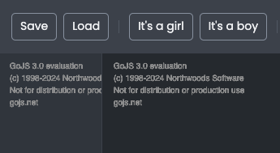
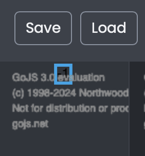
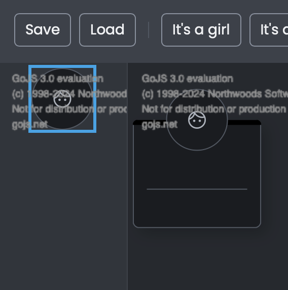

# Palette and drag'n'drop

## Intro
In the lesson about node templates, we've added the possibility to add new nodes via buttons.
The problem with this solution is that we first need to scroll to an added node before we want to place it somewhere.
A better option would be to just drag such a template on the diagram and immediately place it where we want.
This issue can be resolved using a palette and it's something that we'll focus on in this lesson.

## Lesson Objectives
* How to create the palette which will improve the user experience of adding new nodes.
* How to create different styles of the same node inside the palette.
* How to handle adding the nodes to the groups.

## Creating the palette
If you open the app, you can see that we have a place where we'd like to put our palette.
Let's move on then and add there our palette.
Firstly, create a new directory called `palette` inside the `gojs` directory, and inside of it add a `palette.ts` file with the code below:

```typescript
//palette.ts
import * as go from "gojs";

const $ = go.GraphObject.make;

export const createPalette = (paletteDiv: HTMLDivElement) => {
  const palette = $(go.Palette, paletteDiv);
};
```

Above code looks familiar to what we did while we were creating the diagram, but this time we are using `go.Palette`.
To watch the result, we need to call this function the same way we did it for the diagram.

```typescript
//index.ts
import { createPalette } from "./gojs/palette/palette";
//...
window.addEventListener("load", () => {
  //...
  createPalette(paletteDiv);
});
```

Add this code under the `createDiagram` call and let's observe the result.



Okay, now it looks almost like there are two diagrams, but the left one is the palette, so it's treated differently by GoJS functionalities.
On the other hand, both, the diagram, and the palette have a lot in common.
We'll see the commonalities later in this lesson.

## Adding elements to the palette
Once we've created our palette, it'd be good to add there some elements.
This is the first place where we'll see some similarities with the diagram.
To add elements inside the palette we just need to declare the `nodeDataArray` property, same as for the diagram.

```typescript
//palette.ts
//...
export const createPalette = (paletteDiv: HTMLDivElement) => {
  //...
  palette.model.nodeDataArray = [{}];
};

```

After adding these lines of code you should see a change inside the palette.
At the top of it there will be a number, which is just a node, without any template.
Try to grab it and drag it onto the diagram.



If you did everything properly, our application should look like in the picture above.
What happened there is while we're dragging the node inside the palette, the task of visualizing such node has been taken by the palette.
When we dragged it onto the diagram this task has been taken by the diagram.
That's why the same object looks different in the palette and the diagram.
It means that we can define a different look of an object depending on whether it's in the palette, or in the diagram which could be useful in some cases.

Let's represent a node for a boy just by the picture of the boy's face.
Go to the `templates` directory in which we'll create a `palette-node-template.ts` file.
If you want, you could try to create this template on your own since it'll reuse some parts from the `node-template.ts` file. If you don't want to do it on your own, just use the code below:

```typescript
//palette-node-template.ts
import * as go from "gojs";

import { MAN_AVATAR, WOMAN_AVATAR } from "../../consts/icons";
import { CssVariable, theme } from "../../theme";
import { Gender } from "../../types/data-types";

const $ = go.GraphObject.make;

export const createPaletteNodeTemplate = () =>
  $(go.Node, go.Panel.Spot, photoShape(), photo());

const photoShape = (size: number = 60) =>
  $(go.Shape, "Circle", {
    desiredSize: new go.Size(size, size),
    fill: theme.getValue(CssVariable.Gray600),
    stroke: theme.getValue(CssVariable.Gray500),
  });

const photo = (size: number = 60) =>
  $(
    go.Panel,
    go.Panel.Spot,
    {
      isClipping: true,
    },
    $(go.Shape, "Circle", {
      desiredSize: new go.Size(size - 1, size - 1),
      strokeWidth: 0,
    }),
    $(
      go.Picture,
      {
        imageStretch: go.ImageStretch.UniformToFill,
        desiredSize: new go.Size(size - 1, size - 1),
      },
      new go.Binding("source", "gender", (gender: Gender) =>
        gender === "F" ? WOMAN_AVATAR : MAN_AVATAR
      )
    )
  );
```

We won't dive into the code above since, such it was explained during a node templates lesson.
The main difference here is that we now bind only to a `gender` property to change an image, not the whole data of the object.
Now we need to assign this template to the `nodeTemplateMap` of the palette. Similarly to what we've done during the lesson on the diagram instance.

```typescript
//pallete.ts
//...
import { createPaletteNodeTemplate } from "../templates/palette-node-template";
//...
export const createPalette = (paletteDiv: HTMLDivElement) => {
  //...
  palette.nodeTemplateMap = new go.Map([
    { key: "", value: createPaletteNodeTemplate() },
  ]);
  palette.model.nodeDataArray = [{ gender: "M" }];
};
```

Okay, we've declared a node template, let's save the changes and go to the browser to see if the boy's picture will be displayed in the palette.



Now the node inside the palette tells us more about how the node will look like when we drag it onto the diagram.
Before we move on, let's make some small adjustments.
Firstly, let's add `name` property, so when we drop the node onto the diagram we'll see a placeholder for the family member's name.
Secondarily, we'll add some padding to the palette itself.

```typescript
//palette.ts
export const createPalette = (paletteDiv: HTMLDivElement) => {
  //...
  palette.padding = 20;
  //...
  palette.model.nodeDataArray = [{ gender: "M", name: "new boy" }];
};
```

## Adding the nodes to the groups
In the previous lesson, we've added groups to our diagram and now we've enabled the option to drag the nodes onto the diagram.
It'd be nice to connect these two functionalities together and assign the node to the group onto which it has been dropped.
The question is where to start or where should we take care of such functionality?
The answer is pretty simple! Such events are being handled by the templates.
Let's start with creating a utility function that will take care of adding the nodes to the groups.
Create a new directory called `utils` inside `gojs` and add there `mouse-drop.ts` file.

```typescript
//mouse-drop.ts
export const mouseDrop = (event: go.InputEvent, group: go.Group) => {
  if (!group) {
    return;
  }

  group.addMembers(event.diagram.selection, true);
};
```

The purpose of the function above is to add the diagram selection to the group by its method called [addMembers](https://gojs.net/latest/api/symbols/Group.html#addMembers).
It means that when we call this function on e.g. group mouse drop event it'll add such a node (because it's now selected) to the group.

The next thing we need to do is to make use of this function.
As it was mentioned before, these kinds of events can be handled inside templates.
Let's move to the `group-template.ts`.

```typescript
//group-template.ts
//...
import { mouseDrop } from "../utils/mouse-drop";
//...
export const createGroupTemplate = () =>
  $(
    go.Group,
    go.Group.Spot,
    {
      layout: groupLayout,
      mouseDrop
    },
    //...
  );
```

The [MouseDrop](https://gojs.net/latest/api/symbols/GraphObject.html#mouseDrop) method is being called every time when we drop something onto the template where we declared it.
Two first arguments passed by this method are the same as for our util `mouseDrop` function, that's why we are using an object property value shorthand.
Now if you try to drag the node from the palette onto the group it'll be added at the bottom of the group, not the whole diagram.

## Summary
In this lesson, we've learned how to create and configure the palette.
It'll allow the user to add new nodes to the diagram using drag & drop.
How to create different templates for the palette and the diagram.
What's more, we've handled adding new nodes to the groups using the `mouseDrop` event.

## Homework
Try to add the girl template to the palette and a layout, so that the nodes within the palette will be positioned one under another. (Tip: [GridLayout](https://gojs.net/latest/api/symbols/GridLayout.html)

When we drop the node onto another node inside some group, the dragged node isn't being added to the group.
Try to fix this issue. (Tip: reuse `mouseDrop` inside `node-template`).

