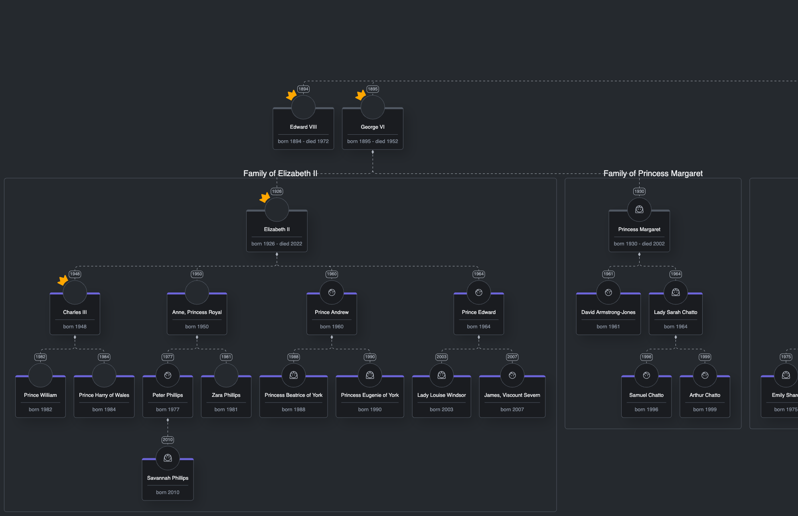
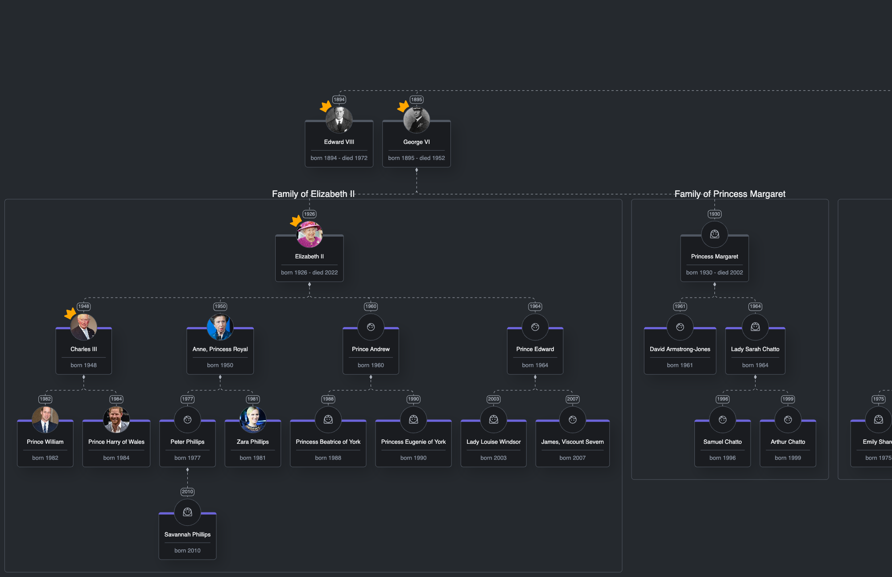

# Export to image

## Intro
In this lesson, we'll address the situation in which the user would like to create an image of the diagram.
By the way, exporting the diagram to an image is a frequently requested feature that the clients would like to have in their application.

## Lesson Objectives
* You'll learn how to export GoJS diagram to PNG and SVG image formats

## Exporting diagram to PNG
Making an image of the GoJS diagram is a quite common scenario, therefore, GoJS provides developers with dedicated methods for them to use.
One of them is [makeImageData](https://gojs.net/latest/api/symbols/Diagram.html#makeImageData). 
This method accepts optional options parameters which allows for customization of the function output and behavior. 
The result of the method can be used in a variety of different ways, e.g. we can save it as a PNG/JPG file or put it as a value for the `src` attribute in the `img` HTML element. 
Explanation of how the parameters influence the resulting image, as well as methods behavior, can be found [here](https://gojs.net/latest/intro/makingImages.html).

Here's a scenario that we'd like to cover. Every time a user clicks a button that says "Export to PNG",
 we'll download a PNG image which will be a snapshot of the whole diagram.

Let's start by adding a new utility function that will be responsible for generating and downloading the image.
Inside the `utils` directory, create a file named `export-to-png.ts` and place the following code within it:

```typescript
//export-to-png.ts
import * as go from "gojs";
import { CssVariable, theme } from "../../theme";
import { downloadFile } from "../../dom/download-file";

export const exportToPng = (diagram: go.Diagram) => {
  diagram.makeImageData({
    background: theme.getValue(CssVariable.Gray800),
    returnType: "blob",
    scale: 1,
    padding: 10,
    callback: (blob) => downloadFile(blob, "myFamilyTree.png"),
  });
};
```

The code above calls `makeImageData` function available on `go.Diagram` with some options. We want the background to be the same as in the app.
A scale set to `1` tells the GoJS to make an image of the whole diagram. We also add some padding to the image.
Next, we ask for `Blob` as returned type, therefore, we must provide a callback function.
The `callback` function downloads the image which is created based on the `blob` passed to the callback function by the `makeImageData` method. The `downloadFile` function is a utility we've already created, so we can focus on the GoJS part.

Alright, once we have our button in place, let's go to the `index.ts` file where we'll add a click listener to the button
```typescript
// index.ts
// ...
import { exportToPng } from "./gojs/utils/export-to-png";
// ...
window.addEventListener("load", () => {
  // ...
  exportToPngButton.onclick = () => exportToPng(diagram);
});
```
Okay, it's time to test the new functionality. Go to the browser window and click the button on the toolbar saying "Export to PNG".
A file with the name "myFamilyTree.png" should be downloaded. Let's open it:


Oh no! Images of the Royal Family are missing!

To solve this, we'll need to set [setCrossOrigin](https://gojs.net/latest/api/symbols/Picture.html#sourceCrossOrigin)
property on the `go.Picture` in our node's template. We need to do this because we're making a cross-origin request to fetch the images. Note that the server also needs to have `access-control-allow-origin: *` set in its header to make it work.

Go to the `node-template.ts` file and set the `setCrossOrigin` property on `go.Picture` in the `photo` element as follows:
```typescript
// node-template.ts
// ...
const photo = (size: number) =>
  $(
    go.Panel,
    go.Panel.Spot,
    //...
    $(
      go.Picture,
      {
        //...
        sourceCrossOrigin: () => 'anonymous'
      },
      //...
    )
  );
// ...
```

Save changes and go back to the browser to verify if this fixed the missing images issue. Export the diagram to PNG once again and open the downloaded image:

Great! The images are back. 

But have you noticed something else?
We asked GoJS to export the whole diagram by passing `scale: 1`, but that did not happen.
If you look at the size of the image that we've downloaded, you'll notice that it has a width of 2000 X 1166px.
Unfortunately, the maximum size of the exported image is 2000 X 2000px. Since our diagram is quite wide, it doesn't fit on X-axis within 2000px.
We still want to support the export to PNG, so we have to resolve this problem. **Spoiler:** This is going to be the subject of your homework :)

Also, when we zoom in on the image, we can see that the quality isn't the best.
There's another way of exporting GoJS diagrams that doesn't have the maximum size constraint and provide far better image quality.
In the next section, we'll export the diagram to SVG.

## Exporting diagram to SVG
In terms of receiving the best quality possible of the diagram's image, SVG is the way to go.
Moreover, it doesn't have a constraint on the maximum size of the exported image.
In this section, we'll add to our application the possibility to export the diagram to SVG.
To create an SVG image from our diagram, we'll have to use a different method from the GoJS library.
This method is called [makeSvg](https://gojs.net/latest/api/symbols/Diagram.html#makeSvg) and is available on the `go.Diagram` class.

Let's start things off again by adding a new utility function. Add a new file called `export-to-svg.ts` inside the `utils` directory with the following code:
```typescript
// export-to-svg.ts
import * as go from "gojs";
import { CssVariable, theme } from "../../theme";
import { downloadFile } from "../../dom/download-file";

export const exportToSvg = (diagram: go.Diagram) => {
  const svg = diagram.makeSvg({
    background: theme.getValue(CssVariable.Gray800),
    scale: 1,
    padding: 10,
  });
  const svgString = new XMLSerializer().serializeToString(svg);
  const blob = new Blob([svgString], { type: "image/svg+xml" });
  
  downloadFile(blob, "myFamilyTree.svg");
};
```

And as previously, in the `index.ts` file set the `onclick` property on the button to call the newly introduced `exportToSvg` function every time the button is clicked:

```typescript
// index.ts
// ...
import { exportToSvg } from "./gojs/utils/export-to-svg";
// ...
window.addEventListener("load", () => {
  // ...
  exportToSvgButton.onclick = () => exportToSvg(diagram);
});
```

Okay, it's time to test the export to SVG. Go to the browser window and click the "Export to SVG" button.
Let's open the SVG file that has been downloaded:


Our diagram has been successfully exported to the SVG format. You can zoom in on it and see everything in great detail.
That's a huge advantage of SVG over PNG or JPEG images.

## Summary
In this lesson, we've learned how to export GoJS diagrams to images. We've covered export to PNG and SVG image formats.
Both of them have their pros and cons. We recommend using SVG format because it delivers great image quality
which is very important when we're dealing with large diagrams. For smaller diagrams, PNG or JPEG formats should be good enough.

## Homework
Do you remember that our exported PNG image of the diagram didn't show the whole diagram?
We've mentioned that this is caused by the maximum image size that we can generate using the `makeImageData` function.
This is not enough for us since our application can display large and especially wide diagrams.
Nonetheless, it's still possible to export huge diagrams to PNG or JPEG formats.

For your homework, please adjust the current solution to support exporting large diagrams to PNG format.
  
> Tip: You can find the answer in the GoJS documentation linked in this lesson.
